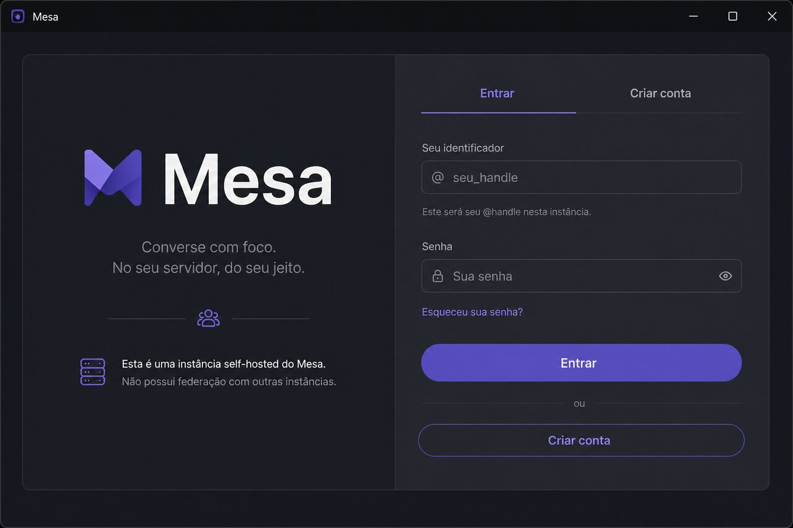
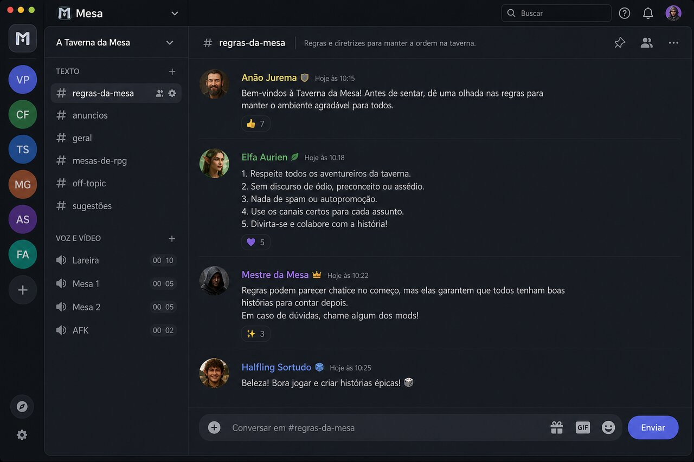
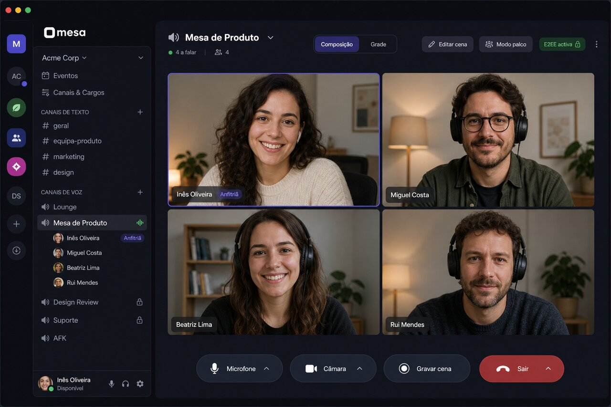

# Mesa

**Chat e vídeo self-hosted**, no espírito do Discord, com **composição nativa de câmeras** e **criptografia ponta-a-ponta (E2EE) por omissão**.

Pensado para mesas de RPG que gravam ou transmitem sessões — e para qualquer grupo pequeno que queira uma instância própria, sem federação e sem o servidor a ler o conteúdo.

| | |
|--|--|
| **Estado** | MVP em evolução (versão `0.1.0` + trabalho em `CHANGELOG.md`) |
| **Stack** | Backend Rust (Axum + SQLite) · Frontend SolidJS (Vite) · LiveKit (voz/vídeo) |
| **Licença** | MIT (prevista) |
| **Operação** | [docs/operar-instancia.md](docs/operar-instancia.md) |
| **Arquitectura** | [docs/arquitetura-tecnica.md](docs/arquitetura-tecnica.md) |
| **Produto** | [docs/product-brief.md](docs/product-brief.md) |

---

## Screenshots

> Ilustrações alinhadas ao visual **Mesa / Nocturne** (protótipo e SPA). Substituir por capturas reais da instância quando conveniente — ficheiros em [`docs/screenshots/`](docs/screenshots/).

### Autenticação



Conta local por **instância de hospedagem** (sem SSO externo no MVP).

### Canal de texto



Rail de servidores, secções **Texto** / **Voz e vídeo**, mensagens e composer.

### Canal de voz / composição



Grade de câmeras, controlos de chamada, chips de E2EE e fluxo **Gravar** / **Religar**.

Referência de design: [`docs/design-ref/Mesa - Protótipo v2.dc.html`](docs/design-ref/Mesa%20-%20Protótipo%20v2.dc.html).

---

## A ideia

Hoje, quem precisa de **chat + chamada** e ao mesmo tempo de **composição visual** (quem aparece onde na cena) costura duas ferramentas: um Discord-like e um OBS/vMix. A Mesa junta as duas preocupações numa só aplicação **self-hosted**:

1. **Instância de hospedagem** — o processo que o operador corre (máquina local ou VPS). Pode hospedar vários **Servidores** (multi-tenancy).
2. **Servidor** — unidade social (como um “server” Discord): dono, canais, convites, membros.
3. **Canal** — **texto** ou **voz/vídeo**, com grade/cenas no voz.

**Não há federação** entre instâncias. O isolamento é total: o que corre na *tua* máquina fica na tua máquina.

A **cunha de entrada** são mestres e grupos de RPG; o produto secundário é “Discord self-hosted” para amigos, podcasts e comunidades pequenas.

---

## Porquê self-host?

- **Confiança**: o operador escolhe onde vivem metadados e blobs; não depende de um SaaS que muda política.
- **Simplicidade operacional**: SQLite embutido por omissão — um ficheiro de base, poucas portas (API + LiveKit + TURN).
- **Sem rede social global**: convite por link; sem diretório obrigatório (opt-in fica no backlog).
- **Grupo pequeno primeiro**: o alvo não é escala de milhão de utilizadores; é uma mesa que sobe em &lt;30 minutos.

Guia prático: [docs/operar-instancia.md](docs/operar-instancia.md) (LiveKit via Docker Compose, backend `cargo run`, SPA `npm run dev`).


## Porquê E2EE?

A Mesa assume **E2EE por omissão** em texto e mídia de voz/vídeo:

| Camada | O que fica cifrado | Quem vê em claro |
|--------|--------------------|------------------|
| **Texto** | Corpo da mensagem (`content_ciphertext`) | Só clientes com a chave do Servidor |
| **Voz/vídeo** | Frames via Insertable Streams (LiveKit) | Só participantes com a chave do canal |
| **Metadados** | Quem enviou, quando, ids, memberships, estado E2EE | Servidor (necessário para operar a instância) |

**Objectivo de privacidade:** o processo servidor (e o admin da instância) **não deve poder ler** o conteúdo das conversas nem descodificar a mídia em condições normais. O SFU LiveKit encaminha pacotes; com E2EE activo **não** decodifica.

### Chaves (contrato conceptual)

1. **Identidade** — par de chaves no cliente; vault opcional no servidor só como blob já cifrado.
2. **Chave do Servidor** — simétrica, gerada no cliente do dono; partilhada entre membros via **envelopes** (`POST /api/servers/{id}/key-envelopes`). O backend só guarda ciphertext.
3. **Chave do canal de voz** — gerada na criação do canal; o cliente confirma **custódia** (`custody_ack` + `channel_key_sealed`). Necessária para **Gravar** / **Religar**.

Contrato de handoff: [`specs/002-fase-1-mvp/contracts/key-handoff.md`](specs/002-fase-1-mvp/contracts/key-handoff.md).

### Excepção consciente: Gravar cena

LiveKit **Egress** (gravação no servidor) é **incompatível** com E2EE activo. Por isso:

1. O dono confirma **Gravar** → a instância desliga E2EE do canal, regista auditoria, tenta Egress.
2. Banner visível para todos: E2EE desligada.
3. **Religar E2EE** exige a chave do canal (custódia).
4. Se o Egress falhar, a API **compensa** e volta a ligar E2EE (não deixa o canal “em claro” a falso).

Contrato: [`specs/006-prototype-ui-parity/contracts/voice-e2ee-egress.md`](specs/006-prototype-ui-parity/contracts/voice-e2ee-egress.md).

---

## Contratos API ↔ Frontend

Sessão: cookie httpOnly `Session` (SameSite=Strict). REST sob `/api/*`. Real-time: `GET /ws` (mesmo cookie). Health: `GET /health` → `{ "ok": true }`.

O frontend (`frontend/src/api/client.ts`) fala JSON; erros tipicamente `{ "error": "...", "code"?: "...", "message"?: "..." }`.

### Autenticação

| Método | Caminho | Notas |
|--------|---------|--------|
| `POST` | `/api/auth/register` | Primeira conta = operador inicial; depois exige convite |
| `POST` | `/api/auth/login` | Emite cookie de sessão |
| `POST` | `/api/auth/logout` | Revoga sessão |
| `GET` | `/api/auth/me` | Conta actual + vault de identidade (se existir) |
| `PUT` | `/api/auth/identity-vault` | Blob cifrado de recuperação |
| `PUT` | `/api/auth/identity` | Actualiza pubkey / identidade |

### Servidores e canais

| Método | Caminho | Contrato / comportamento |
|--------|---------|---------------------------|
| `POST` | `/api/servers` | **Bootstrap** (007): `name` + `custody_ack` + `channel_key_sealed` → cria servidor + texto `geral` + voz `mesa` com chave. Ver [`create-server-bootstrap.md`](specs/007-shell-create-plus/contracts/create-server-bootstrap.md) |
| `GET` | `/api/servers` | Servidores do utilizador |
| `DELETE` | `/api/servers/{id}` | Só dono; WS `server.deleted` |
| `GET`/`POST` | `/api/servers/{id}/channels` | Listar / criar. Voz exige custódia. |
| `GET`/`DELETE` | `/api/channels/{id}` | Detalhe / apagar. Apagar o **último de um tipo** → **409** `last_channel_of_type`. Ver [`delete-channel-last-of-type.md`](specs/007-shell-create-plus/contracts/delete-channel-last-of-type.md) |
| `GET` | `/api/servers/{id}/members` | Membros (handle / identidade) |

### Convites

| Método | Caminho | Notas |
|--------|---------|--------|
| `POST`/`GET` | `/api/servers/{id}/invites` | Criar / listar |
| `GET` | `/api/invites/{code}` | Preview público |
| `POST` | `/api/invites/{code}/accept` | Aceitar → membership (+ handoff de chave) |
| `POST` | `/api/invites/{code}/revoke` | Revogar |

### Mensagens (texto E2EE)

| Método | Caminho | Notas |
|--------|---------|--------|
| `GET`/`POST` | `/api/channels/{id}/messages` | Corpo já cifrado no cliente; servidor só armazena/roteia |

### Voz, grade e cenas

| Método | Caminho | Notas |
|--------|---------|--------|
| `POST` | `/api/channels/{id}/voice/join` | Token LiveKit (segredo de API **nunca** no browser) |
| `POST` | `/api/channels/{id}/voice/e2ee` | Ligar/desligar E2EE + auditoria |
| `POST` | `/api/channels/{id}/egress/start` \| `.../stop` | Gravar / parar (com compensação) |
| `GET`/`PUT` | `/api/channels/{id}/grid` | Layout activo da grade |
| `GET`/`POST` | `/api/channels/{id}/scenes` | Listar / criar cenas |
| `GET`/`PATCH`/`DELETE` | `/api/channels/{id}/scenes/{sid}` | Detalhe / editar / apagar |
| `POST` | `.../scenes/{sid}/duplicate` \| `.../activate` | Multi-cena (API); UI multi-cena adiada — G10 |

### Chaves E2EE (handoff)

| Método | Caminho | Notas |
|--------|---------|--------|
| `POST` | `/api/servers/{id}/key-envelopes` | Publicar envelope selado para um membro |
| `GET` | `/api/servers/{id}/key-envelopes/me` | Envelope do utilizador actual |

### WebSocket — eventos relevantes

Envelope: `{ "event", "server_id"?, "payload" }`.

| Evento | Uso no frontend |
|--------|-----------------|
| `message.new` | Nova mensagem (ciphertext) |
| `presence.update` | Online / canal de voz |
| `channel.e2ee_changed` | Actualizar chip E2EE / LiveKit |
| `channel.deleted` / `server.deleted` | Sair do canal / limpar selecção |
| `key_handoff.requested` / `completed` | Sincronizar chave do servidor |

Detalhe: [`specs/002-fase-1-mvp/contracts/ws-events.md`](specs/002-fase-1-mvp/contracts/ws-events.md) e extensões em specs posteriores.

### Contratos de UI (shell)

- Criação via «+» (rail + secções): [`specs/007-shell-create-plus/contracts/shell-plus-ui.md`](specs/007-shell-create-plus/contracts/shell-plus-ui.md)
- Fidelidade protótipo / media: [`specs/006-prototype-ui-parity/contracts/`](specs/006-prototype-ui-parity/contracts/)

---

## Arranque rápido (dev)

```bash
# 1) LiveKit
cd infra && cp .env.example .env   # se necessário
docker compose up -d

# 2) Backend
cd backend
export DATABASE_URL=sqlite://chat.db?mode=rwc
export BIND=0.0.0.0:8080
export LIVEKIT_API_KEY=instkey
export LIVEKIT_API_SECRET=instsecretinstsecretinstsecret12
export LIVEKIT_WS_URL=ws://127.0.0.1:7880
export COOKIE_SECURE=false
cargo run

# 3) Frontend
cd frontend
npm install
npm run dev
# → https://127.0.0.1:1420  (aceitar certificado de desenvolvimento)
```

Portas: ver tabela em [docs/operar-instancia.md](docs/operar-instancia.md).

---

## Estrutura do repositório

```text
backend/          # API Axum, SQLite, tokens LiveKit, WS hub
frontend/         # SPA SolidJS + tema Mesa/Nocturne
infra/            # Docker Compose LiveKit
docs/             # Produto, arquitectura, operação, daily, screenshots
specs/            # Speckit — features 001… (spec / plan / tasks / contracts)
spike/            # Provas de conceito descartáveis (não é o produto)
CHANGELOG.md      # Versionamento
```

Diário de implementações: [`docs/daily/`](docs/daily/). Backlog vs protótipo v2: [`docs/backlog-prototype-v2-gaps.md`](docs/backlog-prototype-v2-gaps.md).

---

## O que ainda não é (ou está diferido)

- Federação entre instâncias  
- Diretório público / canais privados por permissão fina (G3/G4)  
- UI completa de **múltiplas cenas** (G10 — editar a cena actual mantém-se)  
- Painel de membros à direita estilo Discord (em especificação **008**)  
- Tauri desktop empacotado como único binário “cliente+servidor” (visão de longo prazo)

---