# Mesa

**Chat e vídeo self-hosted**, no espírito do Discord, com **composição nativa de câmeras** e **criptografia ponta a ponta (E2EE) por omissão**.

Pensado para mesas de RPG que gravam ou transmitem sessões, e para qualquer grupo pequeno que queira uma instância própria, sem federação e sem o servidor a ler o conteúdo das conversas.

| | |
|--|--|
| **Estado** | Backend `0.8.1` · Frontend v2 `0.1.0` (reescrita completa, em fase de polimento e corte) |
| **Stack** | Backend Rust (Axum + SQLite) · Frontend **v2** SolidJS (Vite, Tailwind) · LiveKit (voz/vídeo) |
| **Frontend** | [`frontend-v2/`](frontend-v2/) é o cliente atual. [`frontend/`](frontend/) é a v1, mantida só como *rollback* até ao corte |
| **Operação** | [docs/operar-instancia.md](docs/operar-instancia.md) · [docs/deploy-producao.md](docs/deploy-producao.md) |
| **Arquitetura** | [docs/arquitetura-tecnica.md](docs/arquitetura-tecnica.md) |
| **Produto** | [docs/product-brief.md](docs/product-brief.md) |

> Este README descreve a **v2**. A versão anterior do documento (centrada na v1) está em [`docs/archive/README-v1.md`](docs/archive/README-v1.md).

## Índice

1. [A ideia](#a-ideia)
2. [Funcionalidades](#funcionalidades)
3. [Telas](#telas)
4. [Arquitetura](#arquitetura)
5. [Criptografia (E2EE)](#criptografia-e2ee)
6. [Contratos Frontend ↔ Backend](#contratos-frontend--backend)
7. [Fluxos de integração](#fluxos-de-integração)
8. [Arranque rápido (dev)](#arranque-rápido-dev)
9. [Estrutura do repositório](#estrutura-do-repositório)
10. [Fora de escopo e diferido](#fora-de-escopo-e-diferido)

---

## A ideia

Quem precisa de **chat + chamada** e, ao mesmo tempo, de **composição visual** (quem aparece onde na cena) costura hoje duas ferramentas: um chat tipo Discord e um programa de transmissão. A Mesa junta as duas, numa instância que o próprio grupo controla.

1. **Instância**: o processo que o operador corre (máquina local ou VPS). Hospeda vários **Servidores**.
2. **Servidor**: unidade social (dono, cargos, canais, convites, membros).
3. **Canal**: **texto** ou **voz/vídeo**. O canal de voz tem palco com composição de câmeras (cena).

Não há federação entre instâncias: o que corre na tua máquina fica na tua máquina. A primeira conta registada é o operador inicial; as seguintes entram por convite.

**Porquê self-host?** O operador escolhe onde vivem metadados e ficheiros; SQLite embutido e poucas portas (API, LiveKit, TURN) permitem subir uma mesa em menos de 30 minutos; não há rede social global nem diretório obrigatório.

---

## Funcionalidades

Lista do que a v2 faz hoje. A fonte de verdade, com 138 itens e o endpoint de cada um, é [`docs/v2/parity-checklist.md`](docs/v2/parity-checklist.md); o comportamento exigido está nos specs em [`openspec/specs/frontend-v2/`](openspec/specs/frontend-v2/).

### Conta e identidade
- Registo (handle e palavra-passe de 8+ caracteres), com código de convite quando não é a primeira conta (`/invite/:code` ou `?invite=`).
- Login, logout com confirmação, restauro de sessão ao recarregar, troca de conta.
- **Identidade criptográfica** gerada no navegador, protegida por um cofre cifrado com a palavra-passe (guardado no dispositivo e no servidor, sempre cifrado).
- Desbloqueio em dispositivo novo (cofre remoto) e **recuperação de identidade** (nova identidade) quando a palavra-passe do cofre se perde.
- Perfil: nome a mostrar, avatar (JPEG, PNG ou WebP até 1 MiB), idioma **pt-BR / en** e tema **Sistema / Claro / Escuro**, todos persistentes.

### Servidores, membros e cargos
- Criar servidor com **custódia da chave** obrigatória (cria também o canal de texto `geral` e o de voz `mesa`).
- Imagem do servidor, mensagem e canal de boas-vindas, apagar servidor confirmando o nome.
- Membros com pesquisa, mudança de cargo, remoção. **Cargos** com 11 permissões (ver canais, gerir canais, gerir cargos, criar convites, enviar mensagens, apagar mensagens, anexar ficheiros, remover membros, silenciar membros, ligar-se à voz, falar), reordenação e cargo de sistema do dono.
- **Convites** em dois passos, pré-visualização sem sessão, aceitar com registo inline ou com sessão.
- Painel de Membros com presença (online / offline) e aviso quando um convite é consumido.

### Canais e acesso
- Criar canal de texto ou voz (visibilidade pública ou privada, "visível a novos membros"), renomear inline (hífens, 32 caracteres), apagar (o último canal de cada tipo é protegido).
- **ACL por canal**: regras por membro, cargo ou todos, com efeito (permitir / negar) e nível (ler, escrever, ouvir, falar), mais um **inspector de acesso efetivo** que explica fator a fator.
- **Silenciar** membro num canal (5, 10, 15, 30 minutos ou outro valor) e dessilenciar.

### Chat de texto (E2EE)
- Mensagens cifradas no cliente; só o *ciphertext* passa pela rede. Tempo real, agrupamento por remetente, separadores de dia, saltar para o presente.
- Responder com citação, apagar por permissão, **menções** (`@`) e autocompletar de emoji (`:shortcode:`), selector de emoji.
- **Anexos** de imagem (ficheiro ou colar), até 10 por mensagem e 5 MiB cada, cifrados no cliente, com *lightbox* (zoom, download, navegação).
- Pré-visualização de links (até 5 por mensagem).
- Marcar canal como lido e recuperar mensagens perdidas após reconexão.

### Pesquisa e notificações
- Pesquisa livre em todos os canais de texto, **decifrando no cliente**, com o atalho `#canal termo` e `Ctrl/Cmd+F`.
- Notificações persistentes de menção e resposta, marcar uma ou todas como lidas, *deep-link* para a mensagem, canais com novidade e indicadores por servidor.

### Voz e vídeo (LiveKit)
- **Pré-entrada** (*green room*): pré-visualização com blur, medidor do microfone, calibração de dispositivos, "No canal agora" e as ações *Entrar*, *Testar vídeo* (faixa sintética, sem tocar na câmera real) e *Entrar (ouvir)* para quem só pode ouvir.
- Controlos no painel do utilizador: microfone, ensurdecer, câmera, partilha de ecrã, terminar. Entrada só com áudio quando a câmera falha ou é negada.
- **Blur de fundo** em três níveis (sem, leve, forte), indicadores de fala sincronizados no palco, na grade e na sidebar, duração da chamada.
- **Vista Composição**: três layouts (Mestre em Destaque, Painel, Faixa), de 2 a 8 posições, faixa "No banco" para quem não tem posição. **Editor de cena** com arrastar-e-largar, número de posições e confirmação de alterações por guardar.
- **Vista Grade**: câmeras e partilhas de ecrã, com destaque de uma partilha (*spotlight*) sem interromper as transmissões.
- **PiP flutuante**: mini-player arrastável com encaixe nos 4 cantos, visível ao navegar para fora do canal; "Voltar ao palco" e terminar direto no PiP.
- **E2EE de canal de voz** com chip de estado, faixa permanente "E2EE desligada" (quem e quando) e **Religar E2EE** mediante a chave do canal, validada contra a cópia selada no servidor.
- Página **Áudio & Vídeo**: escolha de microfone, saída e câmera, medidor em tempo real, som de teste, pré-visualização e blur partilhado com a chamada.
- Entrar noutro canal de voz sai do anterior; apagar o canal ou o servidor encerra a chamada.

### Transversal
- Responsivo (gaveta abaixo de 768 px), modo claro e escuro, menu de contexto por clique direito e toque longo, faixa de reconexão do WebSocket, estados vazios e de erro por lista, diálogos com `Esc`.

---

## Telas

Capturas reais da v2 (tema escuro, pt-BR) em [`docs/v2/fidelity/`](docs/v2/fidelity/). Cada tela foi comparada com o seu mockup em [`docs/v2/mesa_*`](docs/v2/).

### Entrada e conta

| Entrar / criar conta | Desbloqueio do cofre | Menu da conta |
|:--:|:--:|:--:|
|  |  |  |

### Shell e chat de texto

| Shell com canais e Membros | Chat com respostas, menções e anexos |
|:--:|:--:|
|  |  |

| Pesquisa global | Notificações | Lightbox de anexos |
|:--:|:--:|:--:|
|  |  |  |

### Administração do servidor

| Cargos e permissões | Membros | Convidar (passo 1) |
|:--:|:--:|:--:|
|  |  |  |

| Permissões do canal (ACL) | Inspetor de acesso | Criar canal de voz com custódia |
|:--:|:--:|:--:|
|  |  |  |

### Voz e vídeo

As câmeras verdes são o dispositivo de vídeo falso do Chromium usado nos testes.

| Pré-entrada (*green room*) | Palco em Composição |
|:--:|:--:|
|  |  |

| Editor de cena | Grade |
|:--:|:--:|
|  |  |

| Grade com partilha e destaque | PiP flutuante |
|:--:|:--:|
|  |  |

| E2EE desligada (modo claro) | Religar E2EE | Áudio & Vídeo |
|:--:|:--:|:--:|
|  |  |  |

---

## Arquitetura

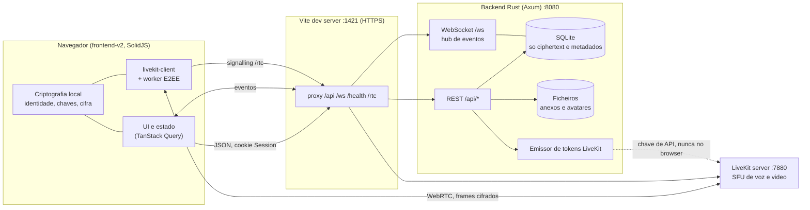
```mermaid
flowchart LR
    subgraph Browser["Navegador (frontend-v2, SolidJS)"]
        UI["UI e estado<br/>(TanStack Query)"]
        CR["Criptografia local<br/>identidade, chaves, cifra"]
        LK["livekit-client<br/>+ worker E2EE"]
    end

    subgraph Dev["Vite dev server :1421 (HTTPS)"]
        PX["proxy /api /ws /health /rtc"]
    end

    subgraph Backend["Backend Rust (Axum) :8080"]
        REST["REST /api/*"]
        WS["WebSocket /ws<br/>hub de eventos"]
        DB[("SQLite<br/>so ciphertext e metadados")]
        FS[("Ficheiros<br/>anexos e avatares")]
        TK["Emissor de tokens LiveKit"]
    end

    LKS["LiveKit server :7880<br/>SFU de voz e video"]

    UI -->|JSON, cookie Session| PX
    UI <-->|eventos| PX
    PX --> REST
    PX --> WS
    REST --> DB
    REST --> FS
    REST --> TK
    WS --- DB
    LK <-->|WebRTC, frames cifrados| LKS
    LK -->|signalling /rtc| PX
    PX --> LKS
    TK -.->|chave de API, nunca no browser| LKS
    CR --- UI
    CR --- LK
```

- **Frontend v2** (`frontend-v2/`): SPA SolidJS. Faz REST em `/api/*` com o cookie `Session` (mesma origem), escuta o `/ws` e fala com o LiveKit por WebRTC. Toda a cifra acontece no navegador.
- **Backend** (`backend/`): API Axum sobre SQLite. Valida sessão e permissões, guarda *ciphertext* e metadados, difunde eventos por WebSocket e emite tokens do LiveKit. O segredo de API do LiveKit nunca sai do backend.
- **LiveKit** (`infra/`): SFU em Docker Compose. A mídia chega cifrada (Insertable Streams), por isso o SFU não a lê.
- **Em produção** o proxy do Vite é substituído por um *reverse proxy* da instância; o cliente continua a falar com uma única origem. Ver [docs/deploy-producao.md](docs/deploy-producao.md).

### Camadas do frontend v2


```mermaid
flowchart TB
    subgraph app["frontend-v2/src"]
        shell["shell/ (rail, sidebar, topbar, estado do servidor)"]
        pages["pages/ e auth/ (rotas)"]
        chat["chat/ (timeline, composer, anexos, pesquisa)"]
        admin["admin/ (servidor, cargos, canais, convites)"]
        voice["voice/ (sessao de chamada, palco, grade, PiP)"]
        crypto["crypto/ (identidade, cofre, chaves)"]
        api["api/ (http, realtime, tipos, endpoints)"]
    end
    shell --> api
    pages --> api
    chat --> api
    chat --> crypto
    admin --> api
    admin --> crypto
    voice --> api
    voice --> crypto
    api --> net(("REST + WS"))
```

---

## Criptografia (E2EE)

**Objetivo:** o processo servidor (e quem o opera) não deve poder ler o conteúdo das conversas nem decifrar a mídia em condições normais.

| Camada | O que fica cifrado | Quem vê em claro |
|--------|--------------------|------------------|
| **Texto e anexos** | Corpo da mensagem (`content_ciphertext`) e bytes dos anexos | Só clientes com a chave do servidor |
| **Voz e vídeo** | Frames, via Insertable Streams do LiveKit | Só participantes com a chave do servidor |
| **Metadados** | Quem enviou, quando, ids, membros, estado E2EE do canal | O servidor (necessário para operar) |

Limitações assumidas: o servidor vê metadados, e a pré-visualização de links (`POST /api/unfurl`) faz o servidor buscar o URL, logo ele vê esse URL.

### Hierarquia de chaves

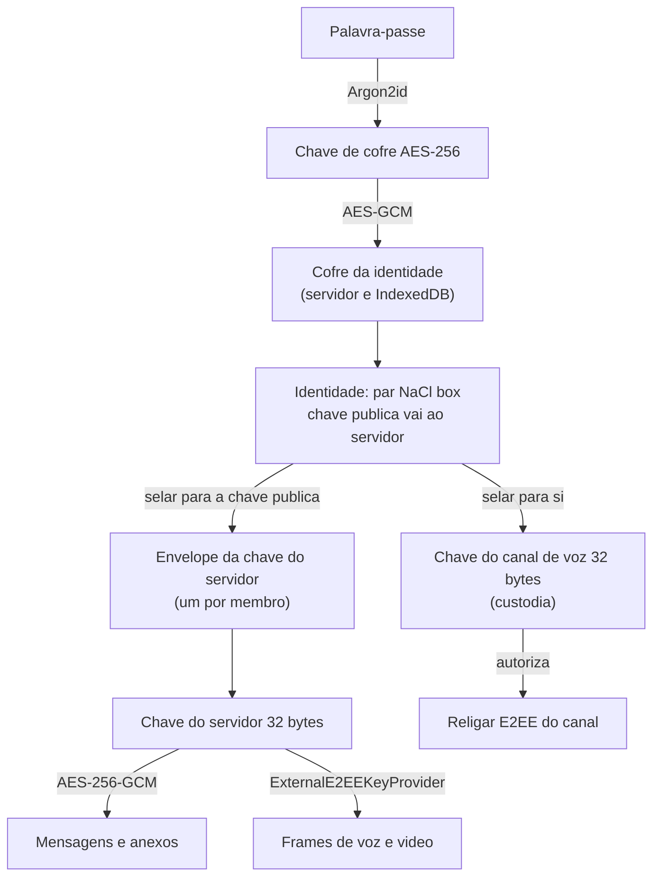
```mermaid
flowchart TD
    PW["Palavra-passe"] -->|Argon2id| WK["Chave de cofre AES-256"]
    WK -->|AES-GCM| VAULT["Cofre da identidade<br/>(servidor e IndexedDB)"]
    VAULT --> ID["Identidade: par NaCl box<br/>chave publica vai ao servidor"]
    ID -->|selar para a chave publica| ENV["Envelope da chave do servidor<br/>(um por membro)"]
    ENV --> SK["Chave do servidor 32 bytes"]
    SK -->|AES-256-GCM| MSG["Mensagens e anexos"]
    SK -->|ExternalE2EEKeyProvider| MEDIA["Frames de voz e video"]
    ID -->|selar para si| CK["Chave do canal de voz 32 bytes<br/>(custodia)"]
    CK -->|autoriza| RELIGAR["Religar E2EE do canal"]
```

- **Identidade**: par `nacl.box` gerado no cliente. O servidor guarda a chave pública e o **cofre** (a chave secreta cifrada com AES-256-GCM, chave derivada por Argon2id). Nunca recebe a chave secreta.
- **Chave do servidor**: 32 bytes gerados no cliente do dono, distribuídos por **envelopes** (caixa selada para a chave pública de cada membro). Cifra mensagens, anexos e a mídia das chamadas.
- **Chave do canal de voz**: 32 bytes gerados na criação do canal e confirmados com `custody_ack`. O servidor guarda uma cópia **selada para o custodiante**. Serve para **religar a E2EE**: o cliente abre a cópia selada (`GET .../voice/channel-key`) e só aceita a chave colada se for a mesma.
- Formatos byte a byte e vetores de teste: [`docs/v2/contracts/crypto-formats.md`](docs/v2/contracts/crypto-formats.md) e `npm run test:contracts`.

---

## Contratos Frontend ↔ Backend

Só os contratos que a **v2** consome. O backend tem mais rotas (listadas em [Rotas do backend que a v2 não usa](#rotas-do-backend-que-a-v2-não-usa)). Tipos de referência: [`frontend-v2/src/api/types.ts`](frontend-v2/src/api/types.ts) e clientes em [`frontend-v2/src/api/endpoints/`](frontend-v2/src/api/endpoints/).

### Convenções

| Tema | Contrato |
|------|----------|
| **Base** | REST sob `/api/*`, JSON, mesma origem. WebSocket em `GET /ws`. Saúde em `GET /health` |
| **Sessão** | Cookie `Session` (httpOnly, SameSite=Strict), emitido por *register* e *login*, revogado por *logout*. TTL por omissão 7 dias |
| **Erros** | `{ "error": "...", "code"?: "...", "message"?: "..." }`. Com `message`, `error` é o código de máquina. Estados usados: 400, 401, 403, 404, 409, 429, 503 |
| **Binários** | Corpo `application/octet-stream` e cabeçalho `X-Mesa-Media-Type` com o tipo real (avatares, imagens de servidor, anexos) |
| **Limites** | Avatar e imagem de servidor 1 MiB (JPEG, PNG, WebP). Anexo 5 MiB (mais GIF). Até 10 anexos e 20 menções por mensagem |
| **Datas** | RFC 3339 (`Timestamp`). Ids são UUID (`Id`) |
| **204** | Respostas sem corpo (apagar, sair, marcar como lido) devolvem `undefined` no cliente |

### Autenticação e conta

| Método | Caminho | Pedido | Resposta | Notas |
|--------|---------|--------|----------|-------|
| `POST` | `/api/auth/register` | `RegisterBody` `{ handle, password, identity_pubkey, identity_vault?, invite_code? }` | `Account` | A primeira conta é o operador inicial; as seguintes exigem convite. Emite o cookie |
| `POST` | `/api/auth/login` | `{ handle, password }` | `Account` (inclui `identity_vault`) | Emite o cookie |
| `POST` | `/api/auth/logout` | — | sem corpo | Revoga a sessão |
| `GET` | `/api/auth/me` | — | `Account` ou 204 | 204 quando não há sessão |
| `PUT` | `/api/auth/identity-vault` | `IdentityVaultPayload` | sem corpo | Guarda o cofre cifrado |
| `PUT` | `/api/auth/identity` | `{ identity_pubkey, identity_vault }` | `Account` | Recuperação: troca a identidade, apaga os envelopes e marca os handoffs como pendentes |
| `PATCH` | `/api/auth/display-name` | `{ display_name: string \| null }` | `Account` | Handle não muda |
| `PUT` / `DELETE` | `/api/auth/avatar` | bytes + `X-Mesa-Media-Type` / — | `Account` / sem corpo | JPEG, PNG, WebP, 1 MiB |
| `GET` | `/api/accounts/{id}/avatar` | — | imagem | Usada em `` |

### Servidores, membros e cargos

| Método | Caminho | Pedido | Resposta | Notas |
|--------|---------|--------|----------|-------|
| `GET` | `/api/servers` | — | `Server[]` | `has_unread`, `has_voice` por servidor |
| `POST` | `/api/servers` | `{ name, custody_ack, channel_key_sealed }` | `Server` | Cria o servidor, o canal `geral` e o canal de voz `mesa` com chave |
| `DELETE` | `/api/servers/{id}` | — | sem corpo | Só o dono. Emite `server.deleted` |
| `GET` / `PUT` / `DELETE` | `/api/servers/{id}/image` | — / bytes / — | imagem / `Server` / sem corpo | Imagem do servidor |
| `GET` / `PATCH` | `/api/servers/{id}/welcome` | `Partial<WelcomeSettings>` | `WelcomeSettings` | Canal e modelo de boas-vindas |
| `GET` | `/api/servers/{id}/members` | — | `Member[]` | Inclui `identity_pubkey` (para selar envelopes) |
| `GET` | `/api/servers/{id}/presence` | — | `{ online_account_ids }` | Complementa o evento `presence` |
| `DELETE` | `/api/servers/{id}/members/{account}` | — | sem corpo | Remover membro |
| `PUT` | `/api/servers/{id}/members/{account}/role` | `{ role_id: Id \| null }` | `{ account_id, role_id }` | Mudar cargo |
| `GET` / `POST` | `/api/servers/{id}/roles` | — / `{ name, capabilities? }` | `ServerRole[]` / `ServerRole` | `RoleCapabilities` tem 11 permissões |
| `PATCH` / `DELETE` | `/api/servers/{id}/roles/{role}` | `{ name?, capabilities? }` / — | `ServerRole` / sem corpo | O cargo de sistema do dono é só de leitura |
| `PUT` | `/api/servers/{id}/roles/positions` | `{ roles: [{ id, position }] }` | `ServerRole[]` | Reordenar |
| `PUT` | `/api/servers/{id}/roles/{role}/members` | `{ member_ids }` | `ServerRole` | Substitui os membros do cargo |

### Convites

| Método | Caminho | Pedido | Resposta | Notas |
|--------|---------|--------|----------|-------|
| `POST` | `/api/servers/{id}/invites` | `{ include_history?, welcome_channel_id?, expires_in_seconds? }` | `Invite` (201) | TTL por omissão 300 s |
| `GET` | `/api/invites/{code}` | — | `InvitePreview` | Público, sem sessão. `requires_account_creation` diz se é preciso registo |
| `GET` | `/api/invites/{code}/handle-available?handle=` | — | `{ available }` | Só para convite utilizável. Limitado por IP |
| `POST` | `/api/invites/{code}/accept` | `{ handle?, password?, identity_pubkey?, identity_vault? }` | `Membership` `{ account_id, server_id, key_handoff_status }` | Com sessão: só entra. Sem sessão: regista e entra. Emite `invite.consumed` e `key_handoff.requested` |

### Canais, acesso e silenciamento

| Método | Caminho | Pedido | Resposta | Notas |
|--------|---------|--------|----------|-------|
| `GET` / `POST` | `/api/servers/{id}/channels` | — / `CreateChannelBody` `{ name, type, grid_slot_count?, visibility?, custody_ack?, channel_key_sealed? }` | `Channel[]` / `Channel` | Canal de voz exige `custody_ack` e `channel_key_sealed` |
| `GET` | `/api/channels/{id}` | — | `Channel` | `my_permission`, `e2ee_enabled`, `has_channel_key` |
| `PATCH` | `/api/channels/{id}` | `{ name?, visibility?, visible_to_new_members? }` | `Channel` | Renomear e visibilidade |
| `DELETE` | `/api/channels/{id}` | — | sem corpo | **409** `last_channel_of_type` se for o último do tipo. Emite `channel.deleted` |
| `GET` | `/api/channels/{id}/mentionables` | — | `Mentionable[]` | Membros que podem ser mencionados neste canal |
| `PUT` | `/api/channels/{id}/read` | `{ last_read_at? }` | sem corpo | Marca o canal como lido |
| `GET` / `PUT` | `/api/channels/{id}/acl` | — / `AclEntryInput[]` | `AclEntry[]` | Regras por membro, cargo ou todos |
| `GET` | `/api/channels/{id}/access/{account}` | — | `AccessReport` | Acesso efetivo e fatores |
| `GET` | `/api/channels/{id}/mutes` | — | `Mute[]` | Silenciamentos ativos |
| `GET` | `/api/channels/{id}/mutes/me` | — | `MyMute` | Para o composer "silenciado até" |
| `PUT` / `DELETE` | `/api/channels/{id}/mutes/{account}` | `{ duration_minutes }` / — | `Mute` / sem corpo | Silenciar e dessilenciar |

### Mensagens, anexos, links e notificações

| Método | Caminho | Pedido | Resposta | Notas |
|--------|---------|--------|----------|-------|
| `GET` | `/api/channels/{id}/messages?before=` | — | `Message[]` | Página mais recente primeiro. `before` pagina para trás. Só `content_ciphertext` |
| `POST` | `/api/channels/{id}/messages` | `PostMessageBody` `{ content_ciphertext, attachment_ids?, mentioned_account_ids?, reply_to_message_id? }` | `Message` (201) | Cria notificações de menção e de resposta. Emite `message.new` |
| `DELETE` | `/api/channels/{id}/messages/{mid}` | — | sem corpo | Por permissão. Emite `message.deleted` |
| `POST` | `/api/channels/{id}/attachments` | bytes cifrados + `X-Mesa-Media-Type` | `Attachment` (201) | O backend guarda bytes opacos |
| `GET` | `/api/attachments/{id}` | — | bytes + `X-Mesa-Media-Type` | Cifrados |
| `POST` | `/api/unfurl` | `{ url }` | `LinkPreview` | O servidor busca o URL (ele vê o URL) |
| `GET` | `/api/notifications?unread_only=&limit=` | — | `Notification[]` | `kind` é `mention` ou `reply` |
| `POST` | `/api/notifications/{id}/read` | — | sem corpo | |
| `POST` | `/api/notifications/read-all` | — | sem corpo | Ação "Limpar" |

### Voz, grade e E2EE do canal

| Método | Caminho | Pedido | Resposta | Notas |
|--------|---------|--------|----------|-------|
| `POST` | `/api/channels/{id}/voice/join` | `{ mic_on, cam_on }` | `VoiceJoin` `{ token, url, room }` | Token LiveKit. `can_publish` segue a permissão de falar. Faz *upsert* da ocupação e tira o utilizador de outra mesa |
| `POST` | `/api/channels/{id}/voice/leave` | — | sem corpo | Liberta a posição na grade. Também chamado com `keepalive` ao fechar a aba |
| `PATCH` | `/api/channels/{id}/voice/media` | `{ mic_on?, cam_on?, screen_on? }` | sem corpo | Sem corpo serve de *heartbeat*. 403 se não for ocupante |
| `GET` | `/api/servers/{id}/voice-occupancy` | — | `VoiceOccupancy` | Snapshot, depois acompanhado por `voice.occupancy` |
| `POST` | `/api/channels/{id}/voice/e2ee` | `{ enabled, intent? }` | `{ e2ee_enabled, audit_id, at }` | Só o dono e só com `has_channel_key`. Regista auditoria. Emite `channel.e2ee_changed` |
| `GET` | `/api/channels/{id}/voice/channel-key` | — | `{ channel_key_sealed }` | Só o custodiante (403 caso contrário, 404 sem chave). Base da validação ao religar |
| `GET` / `PUT` | `/api/channels/{id}/grid` | — / `GridLayout` | `GridLayout` | Layout e posições da cena. `PUT` emite `grid.updated` |
| `GET` | `/api/channels/{id}/scenes` | — | `SceneList` | A v2 usa só a cena ativa |

### Chaves (handoff)

| Método | Caminho | Pedido | Resposta | Notas |
|--------|---------|--------|----------|-------|
| `POST` | `/api/servers/{id}/key-envelopes` | `{ account_id, sealed_key }` | 201 sem corpo | `sealed_key` é Base64 da caixa selada (80 bytes). Marca o handoff como concluído e emite `key_handoff.completed` |
| `GET` | `/api/servers/{id}/key-envelopes/me` | — | `{ server_id, account_id, sealed_key }` | 404 "key envelope not ready" enquanto o handoff está pendente |

### Eventos WebSocket

Ligação `GET /ws` com o mesmo cookie. O cliente **só recebe**; a única mensagem que envia é o texto `ping` (a cada 25 s) como *keep-alive*. Envelope:

```json
{ "event": "message.new", "server_id": "uuid", "payload": { } }
```

| Evento | Destinatários | Payload | Efeito no cliente |
|--------|---------------|---------|-------------------|
| `message.new` | Quem pode ver o canal | `Message` | Acrescenta à timeline, marca não lido |
| `message.deleted` | Quem pode ver o canal | `{ id, channel_id }` | Remove da timeline |
| `notification.created` | A conta notificada | `Notification` (sem `account_id`) | Sino e indicadores |
| `presence` | Membros do servidor | `{ online_account_ids }` | Painel de Membros |
| `voice.occupancy` | Membros do servidor | `{ channel_id, call_started_at, occupants[] }` | Roster da sidebar, duração, PiP |
| `grid.updated` | Membros do servidor | `{ channel_id, grid: GridLayout }` | Palco e editor de cena |
| `scene.changed` | Membros do servidor | `{ channel_id, active_scene_id, scenes[] }` | Cena ativa |
| `channel.e2ee_changed` | Membros do servidor | `{ channel_id, e2ee_enabled, actor_account_id, at, intent }` | Chip, faixa "E2EE desligada", reinício da chamada |
| `channel.deleted` | Membros do servidor | `{ channel_id, server_id }` | Sai do canal e da chamada |
| `channel_role.changed` | Membros do servidor | `{ channel_id, roles }` | Papéis de canal |
| `server.deleted` | Membros do servidor | `{ server_id }` | Limpa a seleção, encerra a chamada |
| `invite.consumed` | Membros do servidor | `{ invite_code, new_member_account_id }` | Atualiza membros e cargos |
| `key_handoff.requested` | Membros que já têm a chave | `{ account_id, identity_pubkey }` | Sela a chave para o novo membro |
| `key_handoff.completed` | O membro novo | `{ account_id }` | Vai buscar o seu envelope |

O backend **não** emite eventos de criação de canal ou de servidor: o cliente refaz o pedido das listas. Após uma interrupção do socket o cliente reconecta com recuo exponencial (0,5 s a 15 s) e volta a pedir o que perdeu.

### Rotas do backend que a v2 não usa

Existem no backend por herança da v1 e estão fora do escopo da v2 (ver [`parity-checklist.md` §12](docs/v2/parity-checklist.md)): gravação (`POST /api/channels/{id}/egress/start` e `/stop`), cenas múltiplas (`POST`, `PATCH`, `DELETE` em `/scenes`, `/duplicate`, `/activate`), papéis de co-diretor (`GET`/`PUT /api/channels/{id}/roles`), e a listagem e revogação de convites (`GET /api/servers/{id}/invites`, `POST /api/invites/{code}/revoke`).

### Política de alterações do backend

O backend da v1 é reaproveitado como está. Alterações só são admitidas quando aditivas, retrocompatíveis, com tarefa própria, testes e registo em [`docs/v2/contracts/backend-change-policy.md`](docs/v2/contracts/backend-change-policy.md). Adições da v2 até agora: `GET /api/invites/{code}/handle-available` e `GET /api/channels/{id}/voice/channel-key`.

---

## Fluxos de integração

### 1. Registo, login e desbloqueio

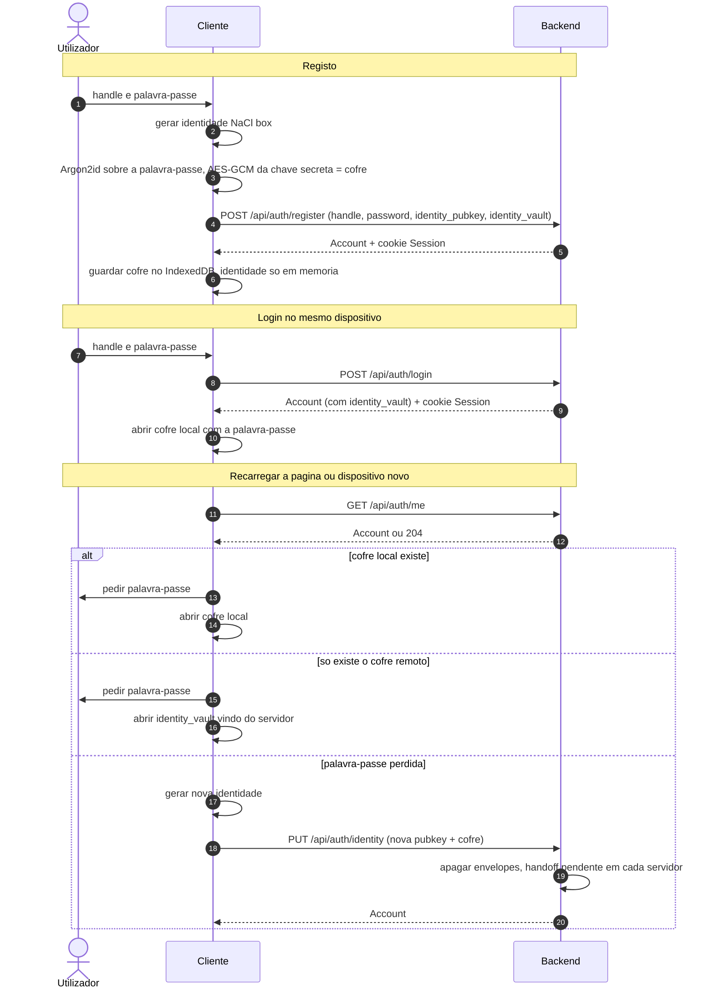
```mermaid
sequenceDiagram
    autonumber
    actor U as Utilizador
    participant C as Cliente
    participant B as Backend

    Note over U,B: Registo
    U->>C: handle e palavra-passe
    C->>C: gerar identidade NaCl box
    C->>C: Argon2id sobre a palavra-passe, AES-GCM da chave secreta = cofre
    C->>B: POST /api/auth/register (handle, password, identity_pubkey, identity_vault)
    B-->>C: Account + cookie Session
    C->>C: guardar cofre no IndexedDB, identidade so em memoria

    Note over U,B: Login no mesmo dispositivo
    U->>C: handle e palavra-passe
    C->>B: POST /api/auth/login
    B-->>C: Account (com identity_vault) + cookie Session
    C->>C: abrir cofre local com a palavra-passe

    Note over U,B: Recarregar a pagina ou dispositivo novo
    C->>B: GET /api/auth/me
    B-->>C: Account ou 204
    alt cofre local existe
        C->>U: pedir palavra-passe
        C->>C: abrir cofre local
    else so existe o cofre remoto
        C->>U: pedir palavra-passe
        C->>C: abrir identity_vault vindo do servidor
    else palavra-passe perdida
        C->>C: gerar nova identidade
        C->>B: PUT /api/auth/identity (nova pubkey + cofre)
        B->>B: apagar envelopes, handoff pendente em cada servidor
        B-->>C: Account
    end
```

### 2. Criar servidor e distribuir a chave

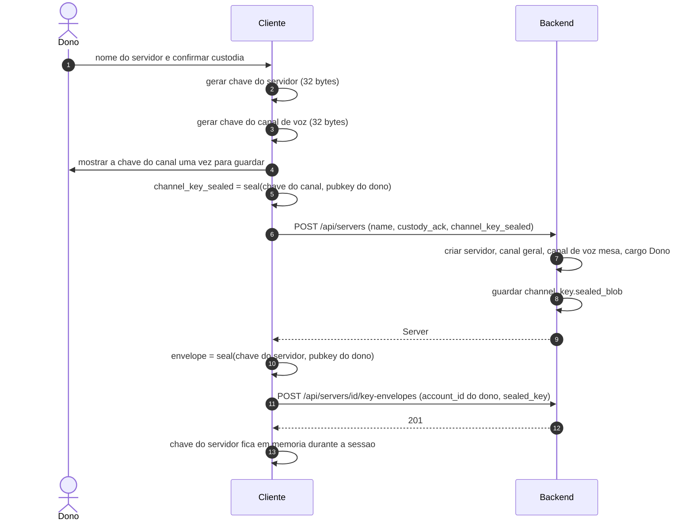
```mermaid
sequenceDiagram
    autonumber
    actor O as Dono
    participant C as Cliente
    participant B as Backend

    O->>C: nome do servidor e confirmar custodia
    C->>C: gerar chave do servidor (32 bytes)
    C->>C: gerar chave do canal de voz (32 bytes)
    C->>O: mostrar a chave do canal uma vez para guardar
    C->>C: channel_key_sealed = seal(chave do canal, pubkey do dono)
    C->>B: POST /api/servers (name, custody_ack, channel_key_sealed)
    B->>B: criar servidor, canal geral, canal de voz mesa, cargo Dono
    B->>B: guardar channel_key.sealed_blob
    B-->>C: Server
    C->>C: envelope = seal(chave do servidor, pubkey do dono)
    C->>B: POST /api/servers/id/key-envelopes (account_id do dono, sealed_key)
    B-->>C: 201
    C->>C: chave do servidor fica em memoria durante a sessao
```

### 3. Convite e entrada de um membro novo (handoff da chave)

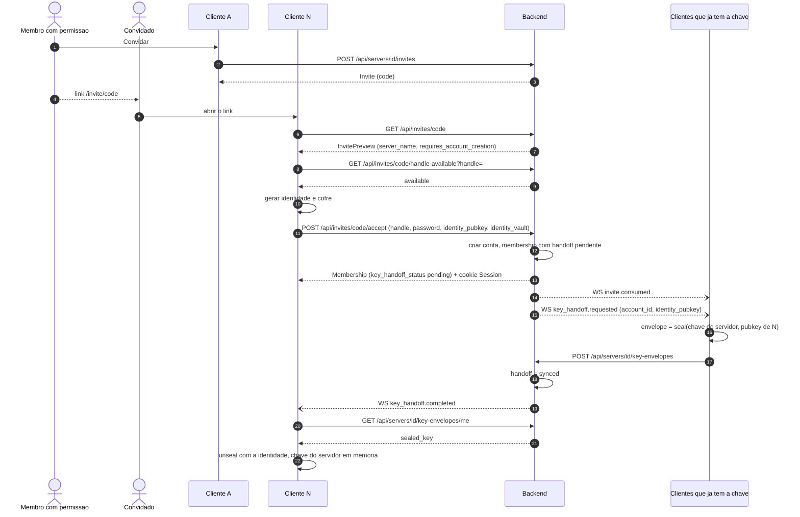
```mermaid
sequenceDiagram
    autonumber
    actor A as Membro com permissao
    actor N as Convidado
    participant CA as Cliente A
    participant CN as Cliente N
    participant B as Backend
    participant CM as Clientes que ja tem a chave

    A->>CA: Convidar
    CA->>B: POST /api/servers/id/invites
    B-->>CA: Invite (code)
    A-->>N: link /invite/code
    N->>CN: abrir o link
    CN->>B: GET /api/invites/code
    B-->>CN: InvitePreview (server_name, requires_account_creation)
    CN->>B: GET /api/invites/code/handle-available?handle=
    B-->>CN: available
    CN->>CN: gerar identidade e cofre
    CN->>B: POST /api/invites/code/accept (handle, password, identity_pubkey, identity_vault)
    B->>B: criar conta, membership com handoff pendente
    B-->>CN: Membership (key_handoff_status pending) + cookie Session
    B--)CM: WS invite.consumed
    B--)CM: WS key_handoff.requested (account_id, identity_pubkey)
    CM->>CM: envelope = seal(chave do servidor, pubkey de N)
    CM->>B: POST /api/servers/id/key-envelopes
    B->>B: handoff = synced
    B--)CN: WS key_handoff.completed
    CN->>B: GET /api/servers/id/key-envelopes/me
    B-->>CN: sealed_key
    CN->>CN: unseal com a identidade, chave do servidor em memoria
```

Se N abrir a app antes de alguém com a chave estar online, `GET .../key-envelopes/me` responde 404 "key envelope not ready" e o cliente espera pelo evento `key_handoff.completed`.

### 4. Enviar e receber uma mensagem

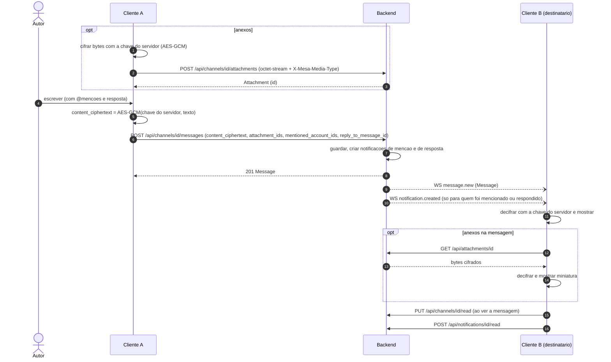
```mermaid
sequenceDiagram
    autonumber
    actor A as Autor
    participant CA as Cliente A
    participant B as Backend
    participant CB as Cliente B (destinatario)

    opt anexos
        CA->>CA: cifrar bytes com a chave do servidor (AES-GCM)
        CA->>B: POST /api/channels/id/attachments (octet-stream + X-Mesa-Media-Type)
        B-->>CA: Attachment (id)
    end
    A->>CA: escrever (com @mencoes e resposta)
    CA->>CA: content_ciphertext = AES-GCM(chave do servidor, texto)
    CA->>B: POST /api/channels/id/messages (content_ciphertext, attachment_ids, mentioned_account_ids, reply_to_message_id)
    B->>B: guardar, criar notificacoes de mencao e de resposta
    B-->>CA: 201 Message
    B--)CB: WS message.new (Message)
    B--)CB: WS notification.created (so para quem foi mencionado ou respondido)
    CB->>CB: decifrar com a chave do servidor e mostrar
    opt anexos na mensagem
        CB->>B: GET /api/attachments/id
        B-->>CB: bytes cifrados
        CB->>CB: decifrar e mostrar miniatura
    end
    CB->>B: PUT /api/channels/id/read (ao ver a mensagem)
    CB->>B: POST /api/notifications/id/read
```

Mensagens apagadas seguem o caminho `DELETE /api/channels/{id}/messages/{mid}` seguido de `message.deleted`. A pesquisa corre toda no cliente: usa as mensagens que os canais abertos já decifraram e busca e decifra a página mais recente dos outros canais de texto. O termo pesquisado nunca é enviado ao servidor.

### 5. Entrar numa chamada de voz/vídeo

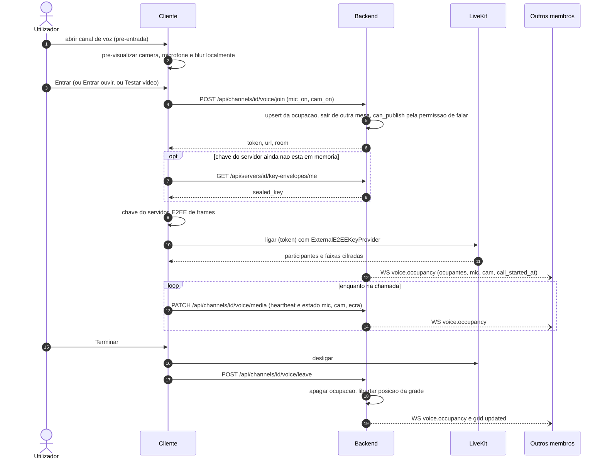
```mermaid
sequenceDiagram
    autonumber
    actor U as Utilizador
    participant C as Cliente
    participant B as Backend
    participant L as LiveKit
    participant O as Outros membros

    U->>C: abrir canal de voz (pre-entrada)
    C->>C: pre-visualizar camera, microfone e blur localmente
    U->>C: Entrar (ou Entrar ouvir, ou Testar video)
    C->>B: POST /api/channels/id/voice/join (mic_on, cam_on)
    B->>B: upsert da ocupacao, sair de outra mesa, can_publish pela permissao de falar
    B-->>C: token, url, room
    opt chave do servidor ainda nao esta em memoria
        C->>B: GET /api/servers/id/key-envelopes/me
        B-->>C: sealed_key
    end
    C->>C: chave do servidor, E2EE de frames
    C->>L: ligar (token) com ExternalE2EEKeyProvider
    L-->>C: participantes e faixas cifradas
    B--)O: WS voice.occupancy (ocupantes, mic, cam, call_started_at)

    loop enquanto na chamada
        C->>B: PATCH /api/channels/id/voice/media (heartbeat e estado mic, cam, ecra)
        B--)O: WS voice.occupancy
    end

    U->>C: Terminar
    C->>L: desligar
    C->>B: POST /api/channels/id/voice/leave
    B->>B: apagar ocupacao, libertar posicao da grade
    B--)O: WS voice.occupancy e grid.updated
```

Ao fechar a aba, o cliente repete `voice/leave` com `keepalive`. Se a câmera falhar ou for negada, entra só com áudio e avisa. Se o canal ou o servidor forem apagados (`channel.deleted`, `server.deleted`), o cliente sai sozinho.

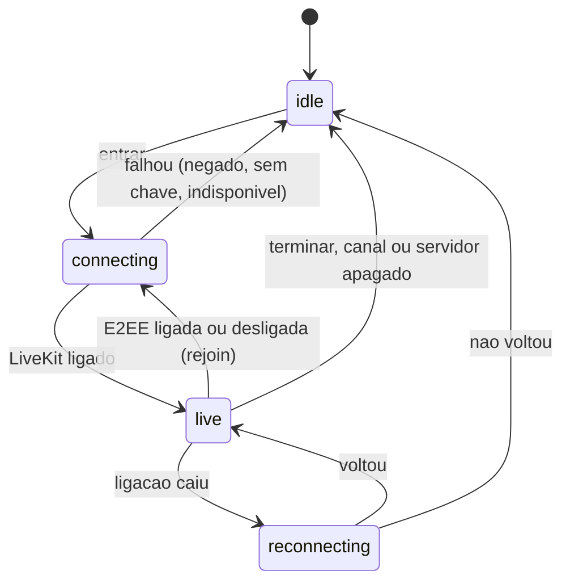
```mermaid
stateDiagram-v2
    [*] --> idle
    idle --> connecting: entrar
    connecting --> live: LiveKit ligado
    connecting --> idle: falhou (negado, sem chave, indisponivel)
    live --> reconnecting: ligacao caiu
    reconnecting --> live: voltou
    reconnecting --> idle: nao voltou
    live --> connecting: E2EE ligada ou desligada (rejoin)
    live --> idle: terminar, canal ou servidor apagado
```

### 6. Desligar e religar a E2EE de um canal de voz

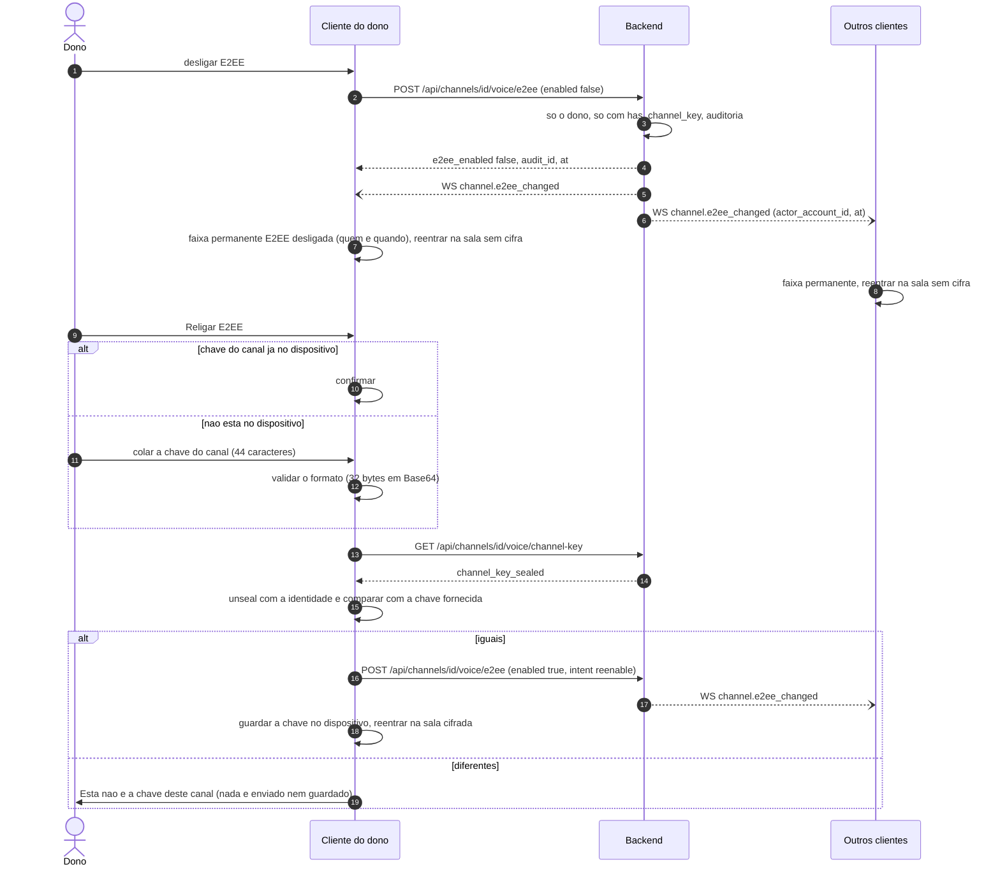
```mermaid
sequenceDiagram
    autonumber
    actor O as Dono
    participant C as Cliente do dono
    participant B as Backend
    participant M as Outros clientes

    O->>C: desligar E2EE
    C->>B: POST /api/channels/id/voice/e2ee (enabled false)
    B->>B: so o dono, so com has_channel_key, auditoria
    B-->>C: e2ee_enabled false, audit_id, at
    B--)C: WS channel.e2ee_changed
    B--)M: WS channel.e2ee_changed (actor_account_id, at)
    C->>C: faixa permanente E2EE desligada (quem e quando), reentrar na sala sem cifra
    M->>M: faixa permanente, reentrar na sala sem cifra

    O->>C: Religar E2EE
    alt chave do canal ja no dispositivo
        C->>C: confirmar
    else nao esta no dispositivo
        O->>C: colar a chave do canal (44 caracteres)
        C->>C: validar o formato (32 bytes em Base64)
    end
    C->>B: GET /api/channels/id/voice/channel-key
    B-->>C: channel_key_sealed
    C->>C: unseal com a identidade e comparar com a chave fornecida
    alt iguais
        C->>B: POST /api/channels/id/voice/e2ee (enabled true, intent reenable)
        B--)M: WS channel.e2ee_changed
        C->>C: guardar a chave no dispositivo, reentrar na sala cifrada
    else diferentes
        C->>O: Esta nao e a chave deste canal (nada e enviado nem guardado)
    end
```

### 7. Cena, composição e grade

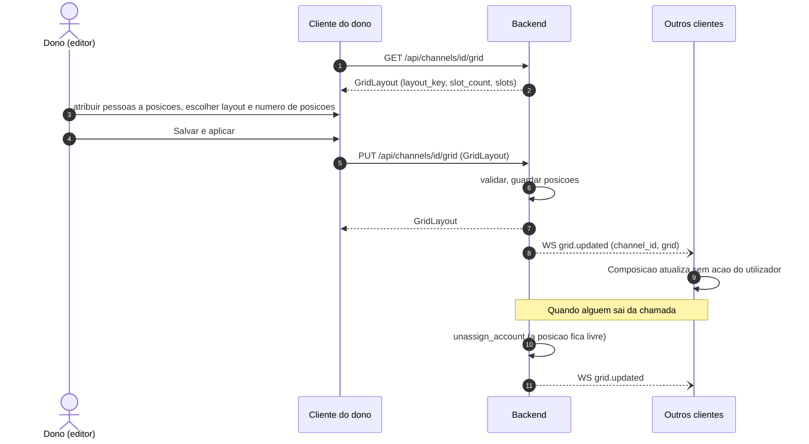
```mermaid
sequenceDiagram
    autonumber
    actor D as Dono (editor)
    participant CD as Cliente do dono
    participant B as Backend
    participant CM as Outros clientes

    CD->>B: GET /api/channels/id/grid
    B-->>CD: GridLayout (layout_key, slot_count, slots)
    D->>CD: atribuir pessoas a posicoes, escolher layout e numero de posicoes
    D->>CD: Salvar e aplicar
    CD->>B: PUT /api/channels/id/grid (GridLayout)
    B->>B: validar, guardar posicoes
    B-->>CD: GridLayout
    B--)CM: WS grid.updated (channel_id, grid)
    CM->>CM: Composicao atualiza sem acao do utilizador

    Note over B,CM: Quando alguem sai da chamada
    B->>B: unassign_account (a posicao fica livre)
    B--)CM: WS grid.updated
```

Quem não tem posição aparece na faixa "No banco". A vista Grade não depende da cena: mostra câmeras e partilhas de quem está na sala.

### 8. Notificação de menção e resposta

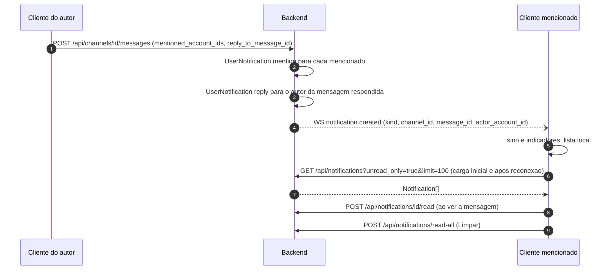
```mermaid
sequenceDiagram
    autonumber
    participant A as Cliente do autor
    participant B as Backend
    participant D as Cliente mencionado

    A->>B: POST /api/channels/id/messages (mentioned_account_ids, reply_to_message_id)
    B->>B: UserNotification mention para cada mencionado
    B->>B: UserNotification reply para o autor da mensagem respondida
    B--)D: WS notification.created (kind, channel_id, message_id, actor_account_id)
    D->>D: sino e indicadores, lista local
    D->>B: GET /api/notifications?unread_only=true&limit=100 (carga inicial e apos reconexao)
    B-->>D: Notification[]
    D->>B: POST /api/notifications/id/read (ao ver a mensagem)
    D->>B: POST /api/notifications/read-all (Limpar)
```

### 9. WebSocket: ligação, presença e reconexão

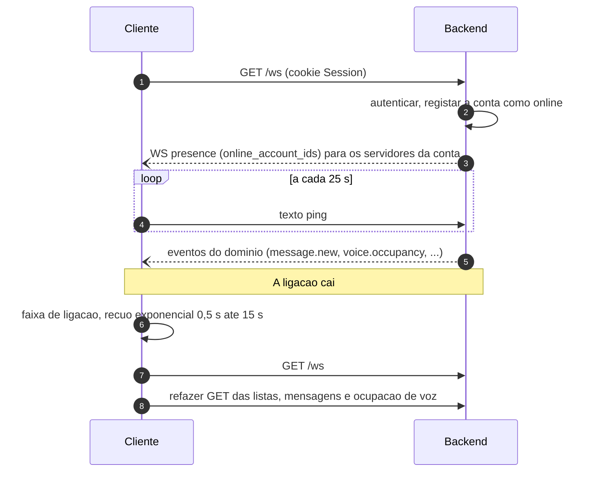
```mermaid
sequenceDiagram
    autonumber
    participant C as Cliente
    participant B as Backend

    C->>B: GET /ws (cookie Session)
    B->>B: autenticar, registar a conta como online
    B--)C: WS presence (online_account_ids) para os servidores da conta
    loop a cada 25 s
        C->>B: texto ping
    end
    B--)C: eventos do dominio (message.new, voice.occupancy, ...)
    Note over C,B: A ligacao cai
    C->>C: faixa de ligacao, recuo exponencial 0,5 s ate 15 s
    C->>B: GET /ws
    C->>B: refazer GET das listas, mensagens e ocupacao de voz
```

---

## Arranque rápido (dev)

Pré-requisitos: Docker, Rust (cargo) e uma versão recente do Node.

```bash
# 1) LiveKit (porta 7880)
cd infra && cp .env.example .env   # se necessário
docker compose up -d

# 2) Backend (porta 8080, só localhost por omissão)
cd backend
export DATABASE_URL=sqlite://chat.db?mode=rwc
export LIVEKIT_API_KEY=instkey
export LIVEKIT_API_SECRET=instsecretinstsecretinstsecret12
export LIVEKIT_WS_URL=ws://127.0.0.1:7880
export COOKIE_SECURE=false
cargo run

# 3) Frontend v2 (https://localhost:1421, aceitar o certificado de desenvolvimento)
cd frontend-v2
npm install
npm run dev
```

O Vite serve a SPA e faz proxy de `/api`, `/ws`, `/health` e `/rtc` para o backend (`8080`) e o LiveKit (`7880`), de modo que o navegador fala sempre com uma só origem. A primeira conta registada passa a ser o operador inicial.

### Variáveis do backend

| Variável | Omissão | Função |
|----------|---------|--------|
| `DATABASE_URL` | `sqlite://chat.db?mode=rwc` | Base de dados |
| `BIND` | `127.0.0.1:8080` | Endereço de escuta |
| `LIVEKIT_WS_URL` | `ws://127.0.0.1:7880` | URL do LiveKit devolvido a quem entra |
| `LIVEKIT_API_KEY` / `LIVEKIT_API_SECRET` | par de exemplo | Credenciais do LiveKit. **Obrigatório trocar em produção** |
| `SESSION_TTL_SECS` | `604800` (7 dias) | Duração da sessão |
| `DEFAULT_INVITE_TTL_SECS` | `300` | Validade dos convites |
| `COOKIE_SECURE` | desligado | Marca o cookie como `Secure` (ligar com HTTPS) |
| `ATTACHMENTS_DIR` / `AVATARS_DIR` | `./data/attachments` / `./data/avatars` | Onde ficam os ficheiros |
| `MESA_PRODUCTION` ou `MESA_ENV` | desligado | Modo produção (recusa as credenciais de exemplo) |
| `MESA_RATE_LIMIT_DISABLED` | desligado | Desliga o limite de pedidos (testes) |
| `LIVEKIT_EGRESS_FILE_PREFIX` | — | Só para a gravação, fora do escopo da v2 |

### Verificação

```bash
cd frontend-v2
npm run build               # tsc + vite build
npm run lint                # eslint
npm run test:contracts      # vetores criptográficos (24 casos)
npm run check:v1-overlap    # independência em relação ao código da v1

cd ../backend && cargo test # contratos e integração da API
```

---

## Estrutura do repositório

```text
backend/          # API Axum, SQLite, tokens LiveKit, hub de WebSocket
frontend-v2/      # SPA SolidJS (cliente atual)
frontend/         # SPA da v1, só como rollback até ao corte
infra/            # Docker Compose do LiveKit
openspec/         # Specs e changes da v2 (specs/ = estado atual, changes/ = trabalho)
docs/             # Produto, arquitetura, operação, contratos e mockups (docs/v2/)
specs/            # Specs históricas da v1 (Speckit)
assets/audio/     # Efeitos sonoros curtos (a ligar ao frontend)
spike/            # Provas de conceito descartáveis
CHANGELOG.md      # Versionamento
```

- Trabalho em curso: `openspec list` (ou [`openspec/changes/`](openspec/changes/)). A reescrita está em [`docs/v2/TR-frontend-v2.md`](docs/v2/TR-frontend-v2.md).
- Fidelidade visual: [`docs/v2/fidelity-protocol.md`](docs/v2/fidelity-protocol.md) e [`docs/v2/AUDIT-fidelity.md`](docs/v2/AUDIT-fidelity.md).

---

## Fora de escopo e diferido

- Federação entre instâncias.
- Gravação de cenas (LiveKit Egress), incompatível com a E2EE; sem UI na v2.
- Múltiplas cenas nomeadas por canal, co-diretor e *templates* de cena partilháveis.
- MLS, multi-dispositivo, Passkeys e semente BIP-39.
- Reações, rolagem de dados, ferramentas VTT, telemetria de rede e perfil estendido.
- Efeitos sonoros de nova menção e de chegada a uma chamada (change `frontend-v2-sound-effects`, planeado).
- Cliente desktop empacotado (Tauri) como binário único cliente + servidor (visão de longo prazo).
