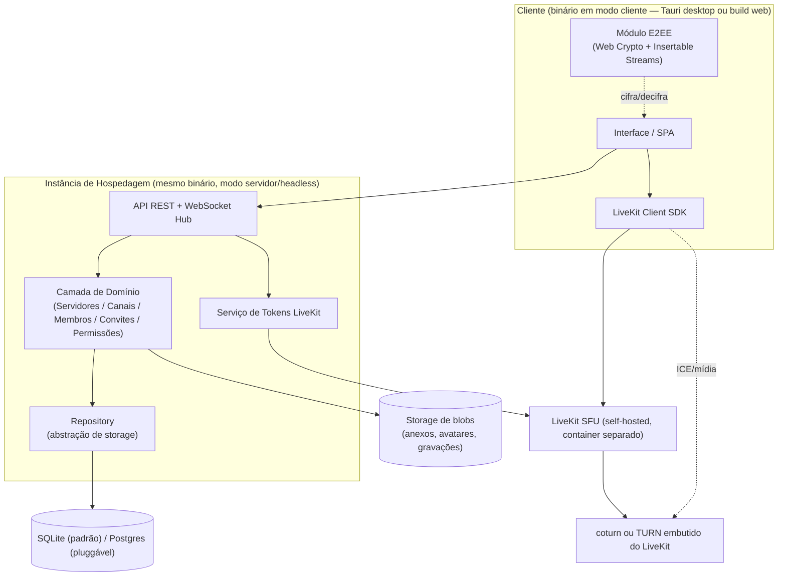
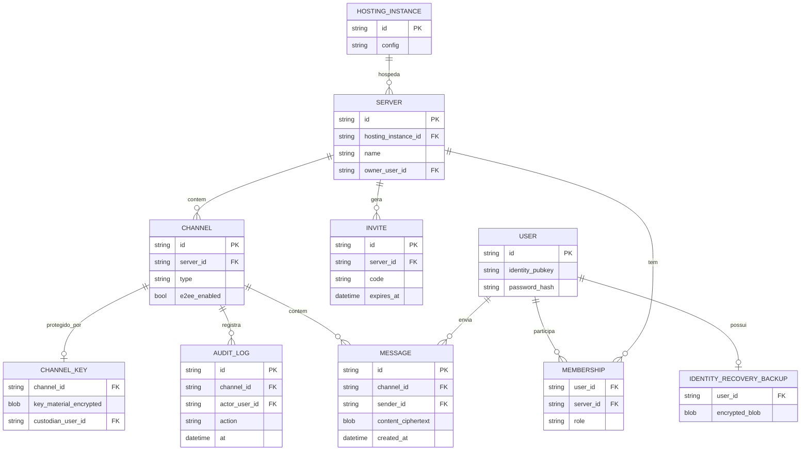
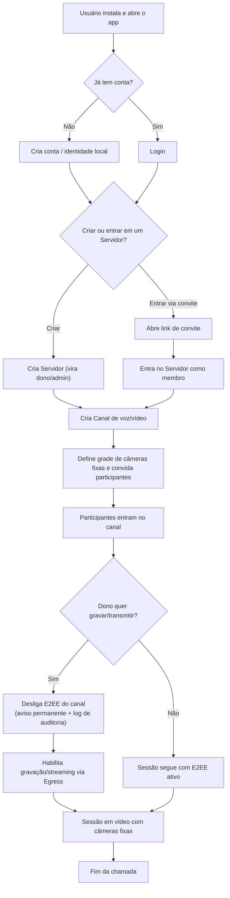
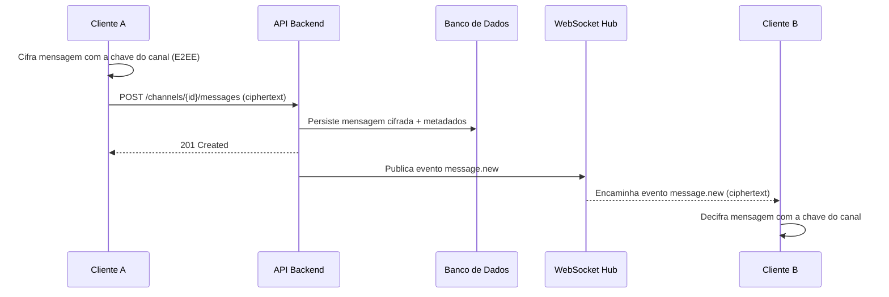
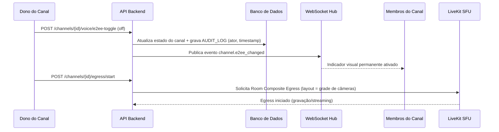

# Arquitetura Técnica — Chat App Self-Hosted

**Autor:** Mary (PO Virtual / Business Analyst)
**Data:** 2026-08-24
**Status:** Rascunho para revisão
**Fontes:** `product-brief.md`, `pesquisa-mercado-e-tecnica.md`, `spike-fase-0.md`

---

## 1. Visão Geral

O sistema é distribuído como **um único binário Rust** que roda em dois modos: **cliente** (shell Tauri, com UI, também compilável como SPA para navegador) e **servidor** (o mesmo binário, headless, expondo API e orquestrando o resto do stack). Cada instalação é uma **Instância de Hospedagem** isolada — sem federação — que pode hospedar múltiplos **Servidores** (multi-tenancy), cada um com seus próprios **Canais** de texto ou voz/vídeo.

Três preocupações atravessam toda a arquitetura e influenciam quase todas as decisões abaixo:

1. **Leveza** — cliente idle bem abaixo de 1GB de RAM, servidor na faixa do TeamSpeak para comunidades pequenas/médias.
2. **Simplicidade operacional para self-host** — instalação em uma trilha simples (SQLite embutido) e uma trilha avançada (Docker Compose com Postgres), sem exigir múltiplos serviços de banco.
3. **E2EE por padrão** — o servidor nunca decodifica conteúdo de texto, voz ou vídeo, exceto quando o dono de um canal desliga conscientemente essa proteção para usar gravação/streaming (Egress).

### 1.1 Diagrama de Componentes



O backend nunca expõe o segredo de API do LiveKit ao cliente: todo token de acesso a uma sala é emitido pelo `TokenSvc`, dentro do processo servidor.

---

## 2. Backend

### 2.1 Camadas internas

- **API layer** — REST para operações CRUD (servidores, canais, membros, convites, mensagens) e um hub WebSocket para eventos em tempo real (novas mensagens, presence, mudança de estado de E2EE de um canal, notificações de sala).
- **Domain layer** — regras de negócio: hierarquia Instância > Servidor > Canal, permissões/cargos, ciclo de vida de convites, política de custódia de chave por canal.
- **Repository layer** — abstração de persistência (padrão repository) para permitir trocar SQLite ↔ Postgres por configuração, sem tocar na camada de domínio. Essa é a decisão de arquitetura que evita reescrita quando a instância cresce.
- **Integration layer** — cliente do LiveKit Server SDK (criação de salas, emissão de tokens JWT, consulta de estado) e configuração de credenciais TURN repassadas ao cliente via API.

### 2.2 Modo dual (cliente/servidor no mesmo binário)

Uma flag de execução (ex.: `--server` / `--headless`) determina o modo:

- **Modo cliente:** inicializa a shell Tauri com a UI; se compilado para web, serve apenas a SPA estática.
- **Modo servidor:** não inicializa UI; sobe a API, o hub WebSocket e as conexões com banco/LiveKit. É o processo que o Docker Compose do instalador avançado orquestra.

### 2.3 Autenticação e sessão

- Conta local por Instância de Hospedagem (sem SSO externo no MVP).
- Sessão via token (a decidir: JWT de sessão vs. cookie de sessão opaco — ambos compatíveis com o requisito de servir tanto desktop quanto navegador; fica como decisão de implementação, não bloqueia o desenho de arquitetura).
- Chave de identidade do usuário (par de chaves E2EE) gerada no primeiro acesso; backup opt-in do lado do servidor é sempre um blob **já cifrado no cliente** (ver seção 6).

### 2.4 Real-time (WebSocket Hub)

Cada Instância de Hospedagem mantém um hub de conexões WebSocket ativas por usuário conectado. O hub é o canal de:

- Novas mensagens em canais de texto (payload já cifrado — o hub apenas roteia, nunca decifra).
- Eventos de presence (quem está online, quem está em qual canal de voz).
- Notificações de mudança de estado de canal (ex.: E2EE desligada por um dono — evento que precisa chegar em tempo real para todos os membros, já que o indicador visual é permanente enquanto durar).

O hub **não** carrega tráfego de mídia (voz/vídeo) — isso é responsabilidade exclusiva do LiveKit, o backend só emite o token de acesso.

---

## 3. API — Superfície

### 3.1 REST (operações CRUD e transacionais)

| Recurso | Endpoints (indicativo) | Observação |
|---|---|---|
| Auth | `POST /auth/register`, `POST /auth/login`, `POST /auth/recovery/backup`, `POST /auth/recovery/restore` | Recovery usa o blob cifrado por senha (Argon2id no cliente) |
| Servidores | `POST /servers`, `GET /servers/{id}`, `PATCH /servers/{id}` | Criação define o criador como dono/admin |
| Canais | `POST /servers/{id}/channels`, `GET /channels/{id}`, `PATCH /channels/{id}` | Tipo `texto` ou `voz_video`; canal de voz/vídeo carrega config de grade de câmeras |
| Membros | `GET /servers/{id}/members`, `PATCH /servers/{id}/members/{user_id}` | Cargos/permissões por servidor |
| Convites | `POST /servers/{id}/invites`, `GET /invites/{code}` | Expira por padrão; admin pode gerar permanente |
| Mensagens | `POST /channels/{id}/messages`, `GET /channels/{id}/messages` | Corpo trafega já cifrado pelo cliente |
| Voz/Vídeo | `POST /channels/{id}/voice/join`, `POST /channels/{id}/voice/e2ee-toggle` | `join` retorna token LiveKit; `e2ee-toggle` grava log de auditoria |
| Egress (pós-MVP) | `POST /channels/{id}/egress/start` | Só disponível quando E2EE do canal está desligada |

### 3.2 WebSocket (eventos)

| Evento | Direção | Payload (resumo) |
|---|---|---|
| `message.new` | servidor → clientes do canal | mensagem cifrada + metadados (remetente, timestamp) |
| `presence.update` | servidor → clientes do servidor | usuário online/offline, em qual canal de voz |
| `channel.e2ee_changed` | servidor → clientes do canal | novo estado + ator + timestamp (espelha o log de auditoria) |
| `invite.consumed` | servidor → admins do servidor | novo membro entrou via convite |

---

## 4. Banco de Dados

### 4.1 Motor

- **Padrão (self-host comum):** SQLite embutido — banco inteiro em um arquivo, portável, sem processo adicional.
- **Trilha avançada / servidor oficial:** Postgres, plugável via a mesma interface de repository.
- Critério de migração: SQLite serializa escritas; sinal prático para migrar é >1000 escritas concorrentes/s sustentadas, erros recorrentes de "database is locked", ou dataset >10GB com queries lentas.

### 4.2 Multi-tenancy

Uma Instância de Hospedagem contém múltiplos Servidores. Não é um banco por Servidor — é um banco por Instância com isolamento lógico: toda tabela relevante (canais, mensagens, membros, permissões) é escopada por `server_id`.

### 4.3 Conteúdo cifrado vs. metadados em claro

O admin da instância não tem chave capaz de decifrar mensagens nem mídia. O banco guarda:
- **Em claro:** metadados estruturais (quem é membro de quê, quando uma mensagem foi enviada, estado de E2EE de um canal, log de auditoria de quem desligou/religou E2EE).
- **Cifrado (ciphertext opaco ao servidor):** corpo de mensagens de texto; a chave de mídia de voz/vídeo trafega apenas entre clientes (Insertable Streams), nunca é persistida em claro no servidor.

Blobs grandes (anexos, avatares, gravações opt-in) ficam fora do banco relacional, em pasta separada no disco — preserva a portabilidade "copiar a pasta" da instância inteira.

### 4.4 Modelo de Dados (conceitual)



`CHANNEL_KEY.key_material_encrypted` guarda a chave do canal cifrada para o custodiante (o criador do canal) — não uma cópia em claro; é o mecanismo que permite reativar a E2EE depois de desligada, desde que o custodiante ainda tenha a chave salva.

---

## 5. Frontend

### 5.1 Alvo duplo (Tauri + navegador)

Uma única SPA é compilada para dois destinos: dentro do webview do Tauri (desktop) e como site estático servido pelo backend em modo servidor (acesso via navegador). Funcionalidades exclusivas de desktop (ex.: ícone de bandeja, notificações nativas, acesso a dispositivos de câmera/microfone sem prompt de navegador) devem degradar graciosamente na build web.

**Framework de UI:** ainda não decidido — candidatos leves e compatíveis com o requisito de "leve" (ex.: Svelte, SolidJS) devem ser avaliados no spike ou logo após; não é uma decisão que este documento resolve.

### 5.2 Módulos do cliente

- **UI/SPA** — componentes de servidor/canal/mensagens/grade de câmeras.
- **Módulo E2EE** — geração/uso de chaves via Web Crypto API; aplica Insertable Streams sobre os tracks do LiveKit Client SDK antes de publicar/depois de assinar.
- **LiveKit Client SDK** — join de sala, publish/subscribe de tracks, ICE via TURN quando necessário.
- **Cliente de API** — chamadas REST + conexão WebSocket persistente para eventos em tempo real.

### 5.3 Grade de câmeras fixas

Layout é um formato de dados simples (posições nomeadas, associadas a `user_id`), definido pelo dono/admin do canal. O mesmo formato é o ponto de reuso futuro com o template de Room Composite Egress (v2) — desenhar esse formato desde já evita retrabalho quando o Egress customizado entrar em escopo.

---

## 6. Segurança e Gestão de Chaves (E2EE)

- **Chave de identidade pessoal:** gerada no dispositivo do usuário. Backup opt-in por padrão: cifrada localmente via Argon2id (derivada da senha da conta), e só o blob já cifrado é enviado ao servidor — zero-knowledge do lado do servidor.
- **Chave por canal de voz/vídeo:** gerada na criação do canal; o criador recebe a chave e deve salvá-la — sem ela, não é possível reativar a E2EE depois de desligada. O app precisa alertar ativamente nesse momento.
- **Mídia (voz/vídeo):** Insertable Streams do LiveKit — o SFU roteia pacotes criptografados sem decodificá-los.
- **Texto:** cifrado no cliente antes de ir para a API; o backend só persiste e roteia ciphertext.
- **Exceção consciente por canal:** o dono pode desligar a E2EE para habilitar Egress (gravação/streaming) — mutuamente exclusivos no LiveKit. A troca gera indicador visual permanente + entrada de log de auditoria (quem, quando); nunca é silenciosa.

---

## 7. Diagramas de Fluxo

### 7.1 Fluxo de Negócio — Jornada do Usuário



### 7.2 Fluxo Técnico — Envio de Mensagem de Texto



### 7.3 Fluxo Técnico — Entrada em Canal de Voz/Vídeo (câmera fixa)

```mermaid
sequenceDiagram
  participant C as Cliente
  participant API as API Backend
  participant Token as Serviço de Tokens
  participant LK as LiveKit SFU
  participant TURN as coturn / TURN embutido
  participant C2 as Outro Participante

  C->>API: POST /channels/{id}/voice/join
  API->>API: Verifica associação/permissão no canal
  API->>Token: Solicita token de acesso à sala
  Token->>LK: Gera JWT assinado (API secret nunca sai do backend)
  Token-->>API: Token de acesso
  API-->>C: Token + config ICE (inclui credenciais TURN)
  C->>LK: Conecta à sala (signaling WebRTC)
  LK->>TURN: Negocia candidatos ICE quando conexão direta falha
  C->>LK: Publica stream de vídeo/áudio (posição fixa configurada)
  LK-->>C2: Encaminha stream via SFU
  C2-->>LK: Publica stream próprio
  LK-->>C: Encaminha stream de C2
  Note over C,C2: Mídia cifrada ponta-a-ponta (Insertable Streams);<br/>LK apenas roteia pacotes, nunca decodifica
```

### 7.4 Fluxo Técnico — Desligamento de E2EE para Egress



---

## 8. Decisões em Aberto

1. **Framework de frontend** (Svelte, SolidJS ou outro) — avaliar leveza e integração com Tauri.
2. **Mecanismo de sessão** (JWT vs. cookie de sessão) — ambos viáveis; decidir na implementação do MVP.
3. **TURN definitivo:** coturn separado vs. TURN embutido do LiveKit — mesma decisão pendente já registrada em `spike-fase-0.md`.
4. **Divisão real do uso do LiveKit:** o cliente usa o **LiveKit JS/TS Client SDK** dentro do webview (não um SDK Rust) para publish/subscribe de mídia; o backend usa o **LiveKit Server SDK/API em Rust** só para emitir tokens. Validar no spike (a) a emissão de token pelo Server SDK em Rust e (b) a disponibilidade de Insertable Streams/Encoded Transforms nos motores de webview do Tauri (WebKitGTK, WebView2, WKWebView) — este último é o risco mais crítico para a premissa de E2EE por padrão, com validação completa (todas as plataformas) ainda pendente além desta máquina de desenvolvimento.
5. **Escala de Postgres:** confirmar se o servidor oficial nasce em Postgres desde o dia 1 (recomendado) ou migra depois de validar tração.

---

**Próximos passos sugeridos:**
- Validar as premissas de conectividade e recursos no spike técnico (`spike-fase-0.md`) antes de comprometer esta arquitetura.
- Resolver as decisões em aberto da seção 8 antes de iniciar a implementação do MVP.
- Detalhar o schema físico (tipos exatos, índices) só depois que o spike confirmar as escolhas de SDK/mídia.
