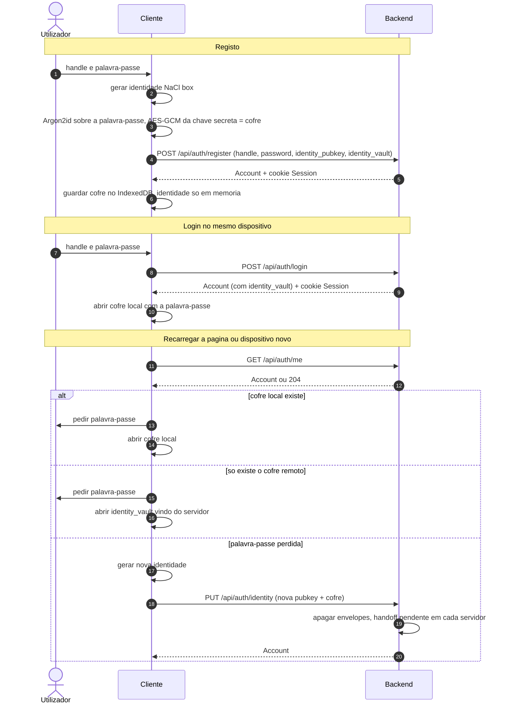
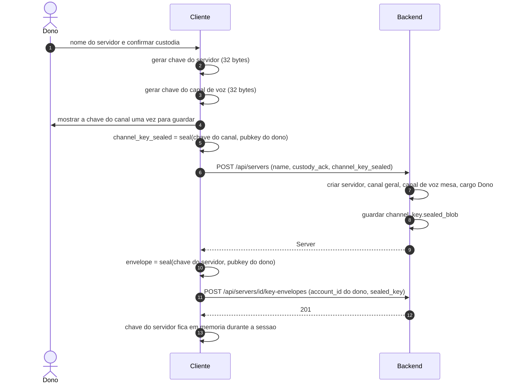
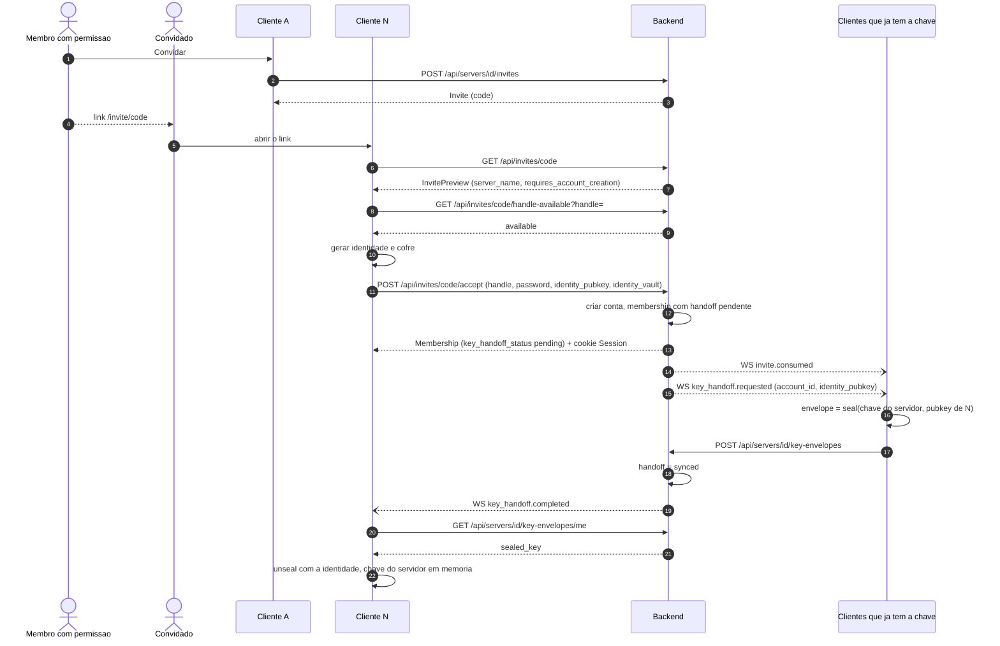
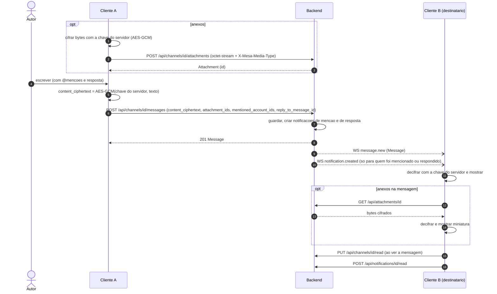
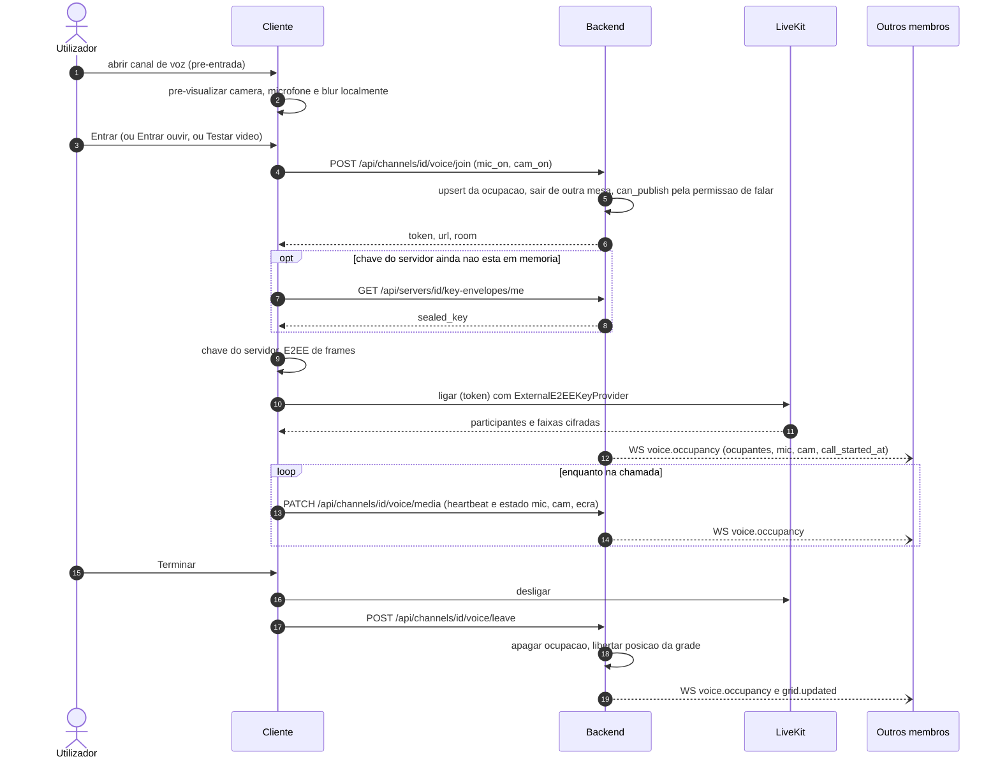
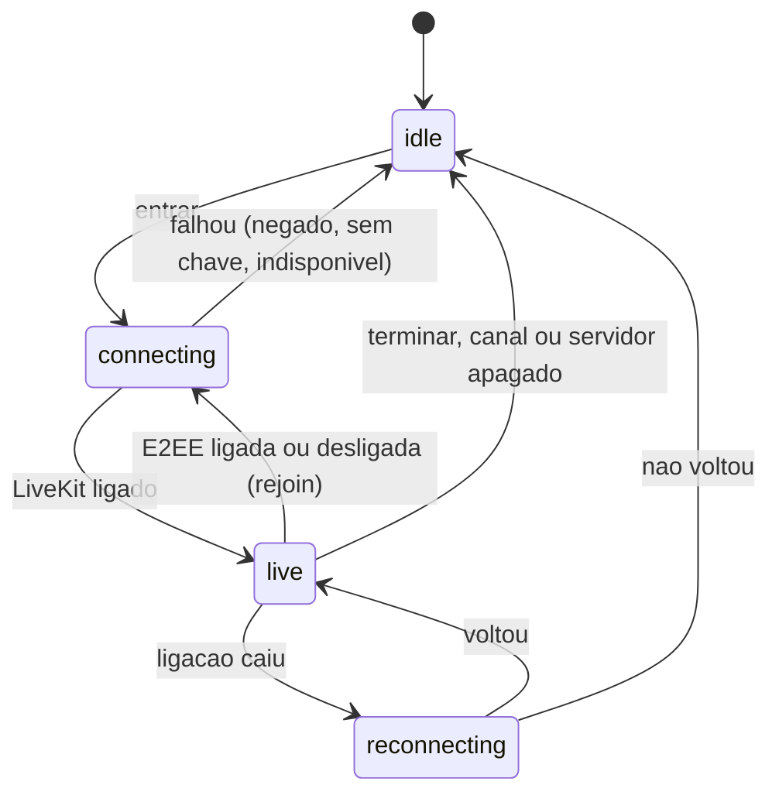
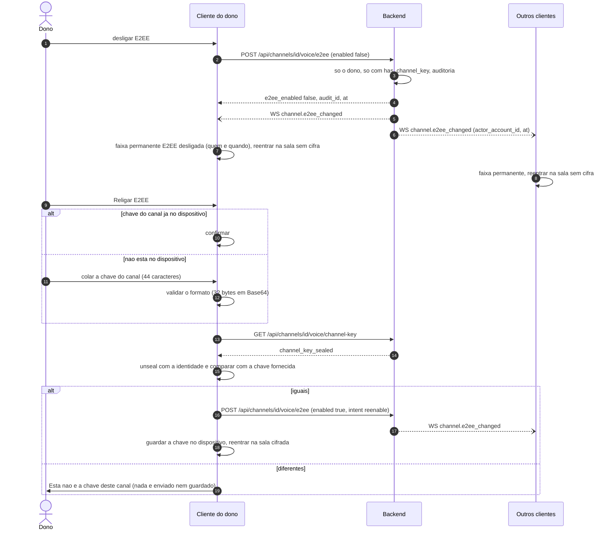
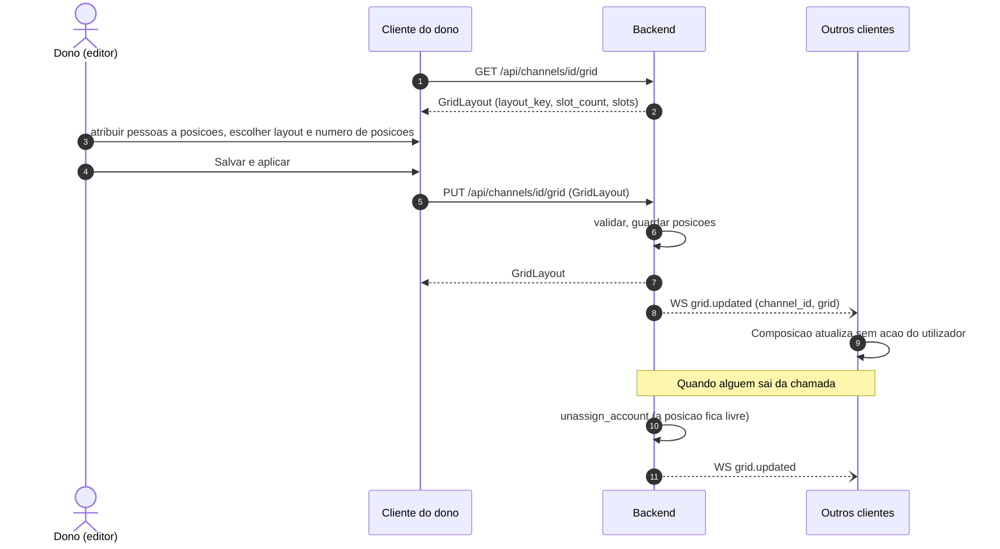
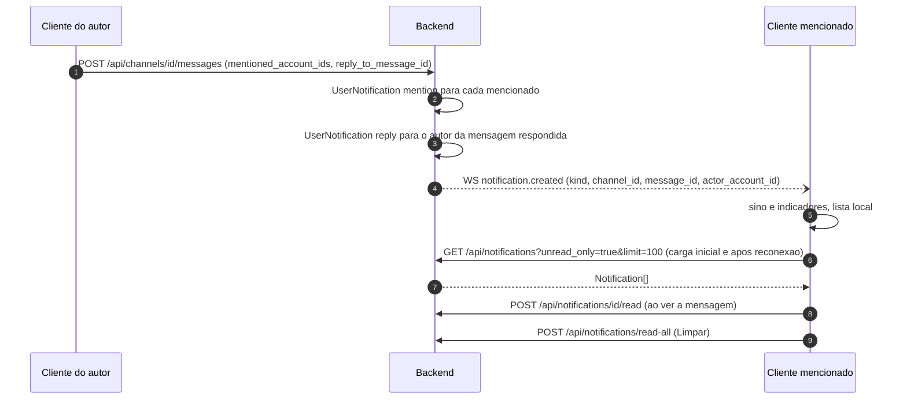
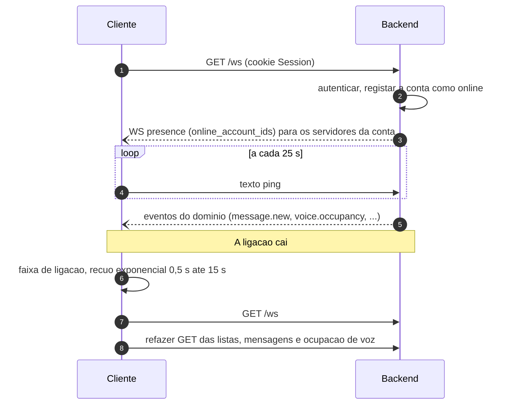

# Contratos e fluxos

Rotas que o frontend v2 consome e os fluxos entre o cliente e o backend. O [README](../README.md) fica com a visão do produto; o detalhe de integração está aqui.

## Contratos Frontend ↔ Backend

Só os contratos que a **v2** consome. O backend tem mais rotas (listadas em [Rotas do backend que a v2 não usa](#rotas-do-backend-que-a-v2-não-usa)). Tipos de referência: [`frontend-v2/src/api/types.ts`](../frontend-v2/src/api/types.ts) e clientes em [`frontend-v2/src/api/endpoints/`](../frontend-v2/src/api/endpoints/).

### Convenções

| Tema | Contrato |
|------|----------|
| **Base** | REST sob `/api/*`, JSON, mesma origem. WebSocket em `GET /ws`. Saúde em `GET /health` |
| **Sessão** | Cookie `Session` (httpOnly, SameSite=Strict), emitido por *register* e *login*, revogado por *logout*. TTL por omissão 7 dias |
| **Erros** | `{ "error": "...", "code"?: "...", "message"?: "..." }`. Com `message`, `error` é o código de máquina. Estados usados: 400, 401, 403, 404, 409, 429, 503 |
| **Binários** | Corpo `application/octet-stream` e cabeçalho `X-Mesa-Media-Type` com o tipo real (avatares, imagens de servidor, anexos) |
| **Limites** | Avatar e imagem de servidor 1 MiB (JPEG, PNG, WebP). Anexo 5 MiB (mais GIF). Até 10 anexos e 20 menções por mensagem |
| **Datas** | RFC 3339 (`Timestamp`). Ids são UUID (`Id`) |
| **204** | Respostas sem corpo (apagar, sair, marcar como lido) devolvem `undefined` no cliente |

### Autenticação e conta

| Método | Caminho | Pedido | Resposta | Notas |
|--------|---------|--------|----------|-------|
| `POST` | `/api/auth/register` | `RegisterBody` `{ handle, password, identity_pubkey, identity_vault?, invite_code? }` | `Account` | A primeira conta é o operador inicial; as seguintes exigem convite. Emite o cookie |
| `POST` | `/api/auth/login` | `{ handle, password }` | `Account` (inclui `identity_vault`) | Emite o cookie |
| `POST` | `/api/auth/logout` | — | sem corpo | Revoga a sessão |
| `GET` | `/api/auth/me` | — | `Account` ou 204 | 204 quando não há sessão |
| `PUT` | `/api/auth/identity-vault` | `IdentityVaultPayload` | sem corpo | Guarda o cofre cifrado |
| `PUT` | `/api/auth/identity` | `{ identity_pubkey, identity_vault }` | `Account` | Recuperação: troca a identidade, apaga os envelopes, marca os handoffs como pendentes e invalida a chave de recuperação anterior |
| `PUT` | `/api/auth/password` | `{ current_password, new_password, identity_vault }` | sem corpo (204) | Autenticada. Mesma identidade; revoga as outras sessões, mantém a actual |
| `POST` | `/api/auth/recovery/code/redeem` | `{ handle, code, password, identity_pubkey, identity_vault }` | `Account` | Sem sessão. Código de uso único emitido pelo operador (`reset-code`); troca identidade e senha, revoga todas as sessões. 401 uniforme para handle/código inválidos |
| `POST` | `/api/auth/recovery/key/challenge` | `{ handle }` | `{ challenge_id, nonce }` | Sem sessão. Nunca revela se a conta existe |
| `POST` | `/api/auth/recovery/key/start` | `{ handle, challenge_id, nonce, signature }` | `{ recovery_vault, ticket }` | Consome o desafio; devolve o cofre de recuperação só com assinatura válida |
| `POST` | `/api/auth/recovery/key/redeem` | `{ handle, ticket, signature, password, identity_vault }` | `Account` | Consome o ticket; mantém `identity_pubkey` e envelopes, revoga todas as sessões |
| `PUT` | `/api/auth/recovery-key` | `{ current_password, recovery_vault, recovery_verifier_pubkey }` | `Account` | Autenticada. Cria ou substitui a chave de recuperação; invalida desafios/tickets antigos |
| `PATCH` | `/api/auth/display-name` | `{ display_name: string \| null }` | `Account` | Handle não muda |
| `PUT` / `DELETE` | `/api/auth/avatar` | bytes + `X-Mesa-Media-Type` / — | `Account` / sem corpo | JPEG, PNG, WebP, 1 MiB |
| `GET` | `/api/accounts/{id}/avatar` | — | imagem | Usada em `` |

### Servidores, membros e cargos

| Método | Caminho | Pedido | Resposta | Notas |
|--------|---------|--------|----------|-------|
| `GET` | `/api/servers` | — | `Server[]` | `has_unread`, `has_voice` por servidor |
| `POST` | `/api/servers` | `{ name, custody_ack, channel_key_sealed }` | `Server` | Cria o servidor, o canal `geral` e o canal de voz `mesa` com chave |
| `DELETE` | `/api/servers/{id}` | — | sem corpo | Só o dono. Emite `server.deleted` |
| `GET` / `PUT` / `DELETE` | `/api/servers/{id}/image` | — / bytes / — | imagem / `Server` / sem corpo | Imagem do servidor |
| `GET` / `PATCH` | `/api/servers/{id}/welcome` | `Partial<WelcomeSettings>` | `WelcomeSettings` | Canal e modelo de boas-vindas |
| `GET` | `/api/servers/{id}/members` | — | `Member[]` | Inclui `identity_pubkey` (para selar envelopes) |
| `GET` | `/api/servers/{id}/presence` | — | `{ online_account_ids }` | Complementa o evento `presence` |
| `DELETE` | `/api/servers/{id}/members/{account}` | — | sem corpo | Remover membro |
| `PUT` | `/api/servers/{id}/members/{account}/role` | `{ role_id: Id \| null }` | `{ account_id, role_id }` | Mudar cargo |
| `GET` / `POST` | `/api/servers/{id}/roles` | — / `{ name, capabilities? }` | `ServerRole[]` / `ServerRole` | `RoleCapabilities` tem 12 permissões; `can_mention_everyone` (Mencionar @todos) vem desligada por omissão |
| `PATCH` / `DELETE` | `/api/servers/{id}/roles/{role}` | `{ name?, capabilities? }` / — | `ServerRole` / sem corpo | O cargo de sistema do dono é só de leitura |
| `PUT` | `/api/servers/{id}/roles/positions` | `{ roles: [{ id, position }] }` | `ServerRole[]` | Reordenar |
| `PUT` | `/api/servers/{id}/roles/{role}/members` | `{ member_ids }` | `ServerRole` | Substitui os membros do cargo |

### Convites

| Método | Caminho | Pedido | Resposta | Notas |
|--------|---------|--------|----------|-------|
| `POST` | `/api/servers/{id}/invites` | `{ include_history?, welcome_channel_id?, expires_in_seconds? }` | `Invite` (201) | TTL por omissão 300 s |
| `GET` | `/api/invites/{code}` | — | `InvitePreview` | Público, sem sessão. `requires_account_creation` diz se é preciso registo |
| `GET` | `/api/invites/{code}/handle-available?handle=` | — | `{ available }` | Só para convite utilizável. Limitado por IP |
| `POST` | `/api/invites/{code}/accept` | `{ handle?, password?, identity_pubkey?, identity_vault? }` | `Membership` `{ account_id, server_id, key_handoff_status }` | Com sessão: só entra. Sem sessão: regista e entra. Emite `invite.consumed` e `key_handoff.requested` |

### Canais, acesso e silenciamento

| Método | Caminho | Pedido | Resposta | Notas |
|--------|---------|--------|----------|-------|
| `GET` / `POST` | `/api/servers/{id}/channels` | — / `CreateChannelBody` `{ name, type, grid_slot_count?, visibility?, custody_ack?, channel_key_sealed? }` | `Channel[]` / `Channel` | Canal de voz exige `custody_ack` e `channel_key_sealed` |
| `GET` | `/api/channels/{id}` | — | `Channel` | `my_permission`, `e2ee_enabled`, `has_channel_key` |
| `PATCH` | `/api/channels/{id}` | `{ name?, visibility?, visible_to_new_members? }` | `Channel` | Renomear e visibilidade |
| `DELETE` | `/api/channels/{id}` | — | sem corpo | **409** `last_channel_of_type` se for o último do tipo. Emite `channel.deleted` |
| `GET` | `/api/channels/{id}/mentionables` | — | `Mentionable[]` | Membros que podem ser mencionados neste canal |
| `PUT` | `/api/channels/{id}/read` | `{ last_read_at? }` | sem corpo | Marca o canal como lido |
| `GET` / `PUT` | `/api/channels/{id}/acl` | — / `AclEntryInput[]` | `AclEntry[]` | Regras por membro, cargo ou todos |
| `GET` | `/api/channels/{id}/access/{account}` | — | `AccessReport` | Acesso efetivo e fatores |
| `GET` | `/api/channels/{id}/mutes` | — | `Mute[]` | Silenciamentos ativos |
| `GET` | `/api/channels/{id}/mutes/me` | — | `MyMute` | Para o composer "silenciado até" |
| `PUT` / `DELETE` | `/api/channels/{id}/mutes/{account}` | `{ duration_minutes }` / — | `Mute` / sem corpo | Silenciar e dessilenciar |

### Mensagens, anexos, links e notificações

| Método | Caminho | Pedido | Resposta | Notas |
|--------|---------|--------|----------|-------|
| `GET` | `/api/channels/{id}/messages?before=` | — | `Message[]` | Página mais recente primeiro. `before` pagina para trás. Só `content_ciphertext` |
| `POST` | `/api/channels/{id}/messages` | `PostMessageBody` `{ content_ciphertext, attachment_ids?, mentioned_account_ids?, reply_to_message_id?, mention_everyone? }` | `Message` (201) | Cria notificações de menção e de resposta. Emite `message.new` |
| `DELETE` | `/api/channels/{id}/messages/{mid}` | — | sem corpo | Por permissão. Emite `message.deleted` |
| `POST` | `/api/channels/{id}/attachments` | bytes cifrados + `X-Mesa-Media-Type` | `Attachment` (201) | O backend guarda bytes opacos |
| `GET` | `/api/attachments/{id}` | — | bytes + `X-Mesa-Media-Type` | Cifrados |
| `POST` | `/api/unfurl` | `{ url }` | `LinkPreview` | O servidor busca o URL (ele vê o URL) |
| `GET` | `/api/notifications?unread_only=&limit=` | — | `Notification[]` | `kind` é `mention` ou `reply` |
| `POST` | `/api/notifications/{id}/read` | — | sem corpo | |
| `POST` | `/api/notifications/read-all` | — | sem corpo | Ação "Limpar" |

### Voz, grade e E2EE do canal

| Método | Caminho | Pedido | Resposta | Notas |
|--------|---------|--------|----------|-------|
| `POST` | `/api/channels/{id}/voice/join` | `{ mic_on, cam_on }` | `VoiceJoin` `{ token, url, room }` | Token LiveKit. `can_publish` segue a permissão de falar. Faz *upsert* da ocupação e tira o utilizador de outra mesa |
| `POST` | `/api/channels/{id}/voice/leave` | — | sem corpo | Liberta a posição na grade. Também chamado com `keepalive` ao fechar a aba |
| `PATCH` | `/api/channels/{id}/voice/media` | `{ mic_on?, cam_on?, screen_on? }` | sem corpo | Sem corpo serve de *heartbeat*. 403 se não for ocupante |
| `GET` | `/api/servers/{id}/voice-occupancy` | — | `VoiceOccupancy` | Snapshot, depois acompanhado por `voice.occupancy` |
| `POST` | `/api/channels/{id}/voice/e2ee` | `{ enabled, intent? }` | `{ e2ee_enabled, audit_id, at }` | Só o dono e só com `has_channel_key`. Regista auditoria. Emite `channel.e2ee_changed` |
| `GET` | `/api/channels/{id}/voice/channel-key` | — | `{ channel_key_sealed }` | Só o custodiante (403 caso contrário, 404 sem chave). Base da validação ao religar |
| `GET` / `PUT` | `/api/channels/{id}/grid` | — / `GridLayout` | `GridLayout` | Layout e posições da cena. `PUT` emite `grid.updated` |
| `GET` | `/api/channels/{id}/scenes` | — | `SceneList` | A v2 usa só a cena ativa |

### Chaves (handoff)

| Método | Caminho | Pedido | Resposta | Notas |
|--------|---------|--------|----------|-------|
| `POST` | `/api/servers/{id}/key-envelopes` | `{ account_id, sealed_key }` | 201 sem corpo | `sealed_key` é Base64 da caixa selada (80 bytes). Marca o handoff como concluído e emite `key_handoff.completed`. **409** `key already exists` quando o envelope próprio já existe com bytes diferentes, ou outro membro já tem envelope no escopo — primeiro escritor vence |
| `GET` | `/api/servers/{id}/key-envelopes/me` | — | `{ server_id, account_id, sealed_key }` | 404 "key envelope not ready" enquanto o handoff está pendente |
| `GET` | `/api/servers/{id}/key-envelopes/exists` | — | `{ exists: boolean }` | Indicador autoritativo de existência de envelope no Servidor, sem expor a chave; usado por `ensureServerKey` para não gerar chave nova quando já existe uma a sincronizar |

### Eventos WebSocket

Ligação `GET /ws` com o mesmo cookie. O cliente **só recebe**; a única mensagem que envia é o texto `ping` (a cada 25 s) como *keep-alive*. Envelope:

```json
{ "event": "message.new", "server_id": "uuid", "payload": { } }
```

| Evento | Destinatários | Payload | Efeito no cliente |
|--------|---------------|---------|-------------------|
| `message.new` | Quem pode ver o canal | `Message` | Acrescenta à timeline, marca não lido |
| `message.deleted` | Quem pode ver o canal | `{ id, channel_id }` | Remove da timeline |
| `notification.created` | A conta notificada | `Notification` (sem `account_id`) | Sino e indicadores |
| `presence` | Membros do servidor | `{ online_account_ids }` | Painel de Membros |
| `voice.occupancy` | Membros do servidor | `{ channel_id, call_started_at, occupants[] }` | Roster da sidebar, duração, PiP |
| `grid.updated` | Membros do servidor | `{ channel_id, grid: GridLayout }` | Palco e editor de cena |
| `scene.changed` | Membros do servidor | `{ channel_id, active_scene_id, scenes[] }` | Cena ativa |
| `channel.e2ee_changed` | Membros do servidor | `{ channel_id, e2ee_enabled, actor_account_id, at, intent }` | Chip, faixa "E2EE desligada", reinício da chamada |
| `channel.deleted` | Membros do servidor | `{ channel_id, server_id }` | Sai do canal e da chamada |
| `channel_role.changed` | Membros do servidor | `{ channel_id, roles }` | Papéis de canal |
| `server.deleted` | Membros do servidor | `{ server_id }` | Limpa a seleção, encerra a chamada |
| `invite.consumed` | Membros do servidor | `{ invite_code, new_member_account_id }` | Atualiza membros e cargos |
| `key_handoff.requested` | Membros que já têm a chave | `{ account_id, identity_pubkey }` | Sela a chave para o novo membro |
| `key_handoff.completed` | O membro novo | `{ account_id }` | Vai buscar o seu envelope |

O backend **não** emite eventos de criação de canal ou de servidor: o cliente refaz o pedido das listas. Após uma interrupção do socket o cliente reconecta com recuo exponencial (0,5 s a 15 s) e volta a pedir o que perdeu.

### Rotas do backend que a v2 não usa

Existem no backend por herança da v1 e estão fora do escopo da v2 (ver [`parity-checklist.md` §12](v2/parity-checklist.md)): gravação (`POST /api/channels/{id}/egress/start` e `/stop`), cenas múltiplas (`POST`, `PATCH`, `DELETE` em `/scenes`, `/duplicate`, `/activate`), papéis de co-diretor (`GET`/`PUT /api/channels/{id}/roles`), e a listagem e revogação de convites (`GET /api/servers/{id}/invites`, `POST /api/invites/{code}/revoke`).

### Política de alterações do backend

O backend da v1 é reaproveitado como está. Alterações só são admitidas quando aditivas, retrocompatíveis, com tarefa própria, testes e registo em [`docs/v2/contracts/backend-change-policy.md`](v2/contracts/backend-change-policy.md). Adições da v2 até agora: `GET /api/invites/{code}/handle-available`, `GET /api/channels/{id}/voice/channel-key`, e as rotas de recuperação de senha (`PUT /api/auth/password`, `POST /api/auth/recovery/code/redeem`, `POST /api/auth/recovery/key/{challenge,start,redeem}`, `PUT /api/auth/recovery-key`, `GET /api/servers/{id}/key-envelopes/exists`).

---

## Fluxos de integração

### 1. Registo, login e desbloqueio



### 2. Criar servidor e distribuir a chave



### 3. Convite e entrada de um membro novo (handoff da chave)



Se N abrir a app antes de alguém com a chave estar online, `GET .../key-envelopes/me` responde 404 "key envelope not ready" e o cliente espera pelo evento `key_handoff.completed`.

### 4. Enviar e receber uma mensagem



Mensagens apagadas seguem o caminho `DELETE /api/channels/{id}/messages/{mid}` seguido de `message.deleted`. A pesquisa corre toda no cliente: usa as mensagens que os canais abertos já decifraram e busca e decifra a página mais recente dos outros canais de texto. O termo pesquisado nunca é enviado ao servidor.

### 5. Entrar numa chamada de voz/vídeo



Ao fechar a aba, o cliente repete `voice/leave` com `keepalive`. Se a câmera falhar ou for negada, entra só com áudio e avisa. Se o canal ou o servidor forem apagados (`channel.deleted`, `server.deleted`), o cliente sai sozinho.



### 6. Desligar e religar a E2EE de um canal de voz



### 7. Cena, composição e grade



Quem não tem posição aparece na faixa "No banco". A vista Grade não depende da cena: mostra câmeras e partilhas de quem está na sala.

### 8. Notificação de menção e resposta



### 9. WebSocket: ligação, presença e reconexão


