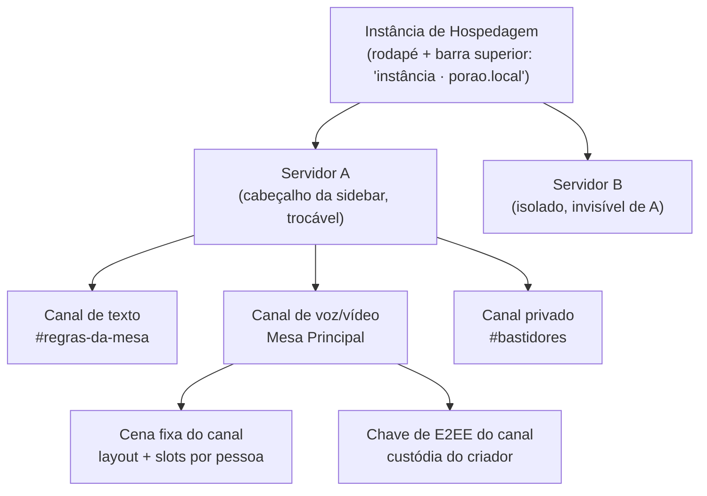
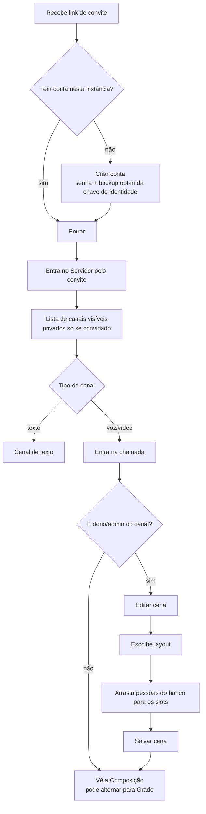
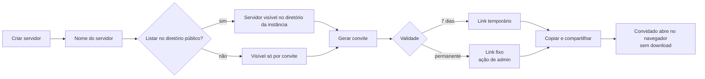
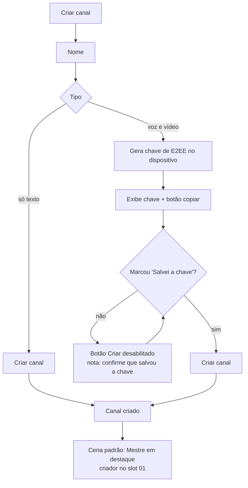
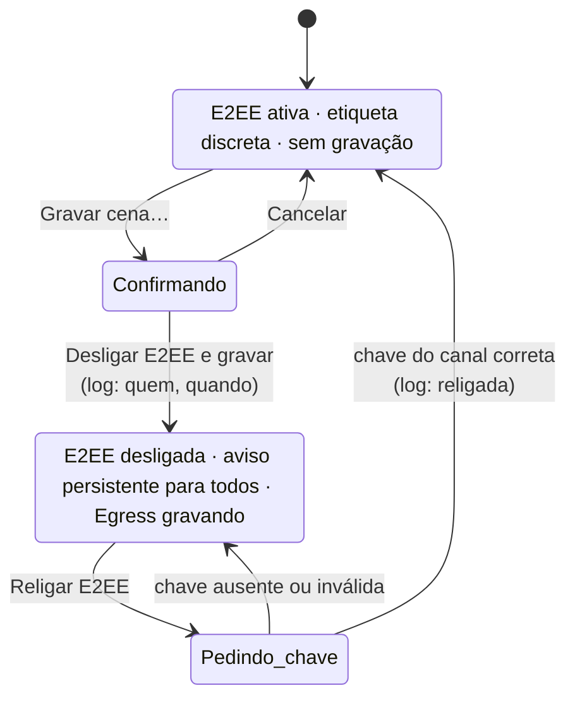
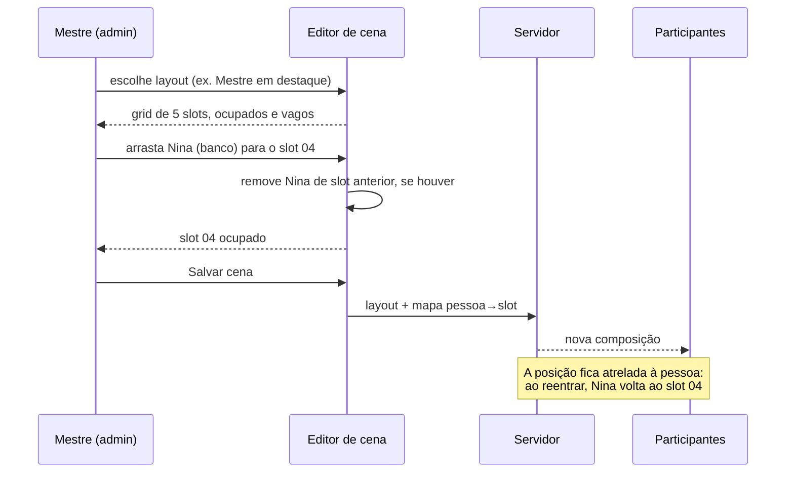
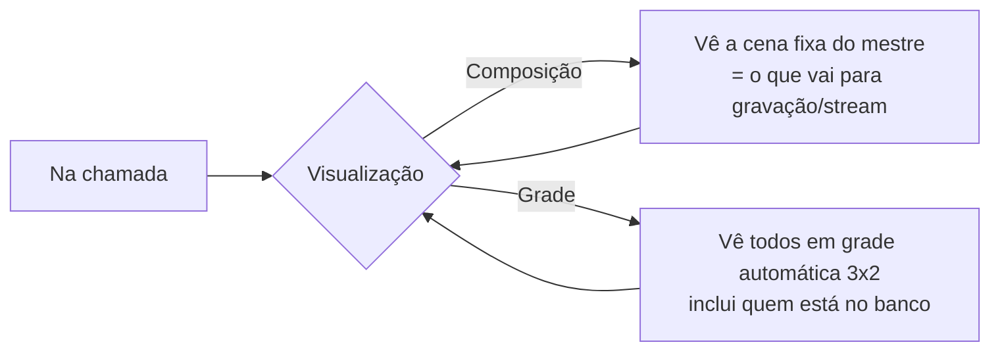

# PRD de Design — Mesa (web)

**Produto:** Mesa — chat self-hosted (texto, voz, vídeo) com composição nativa de câmeras
**Escopo deste documento:** decisões de design da aplicação **web** (MVP), funcionalidades desenhadas e fluxos esperados
**Base:** `uploads/product-brief.md` (Product Brief, Mary — 2026-08-23)
**Artefatos de referência:** `Conceito — Wireframes.dc.html` (exploração), `Mesa — Protótipo.dc.html` (v1, Modernist), `Mesa — Protótipo v2.dc.html` (v2, Nocturne — **direção vigente**)
**Data:** 2026-09-04
**Status:** proposta de design para validação com 1-2 grupos de RPG reais

---

## 1. Premissas e recorte

| Item | Decisão |
| --- | --- |
| Plataforma inicial | **Somente web.** O binário único (Rust + Tauri) segue no roadmap, mas o cliente desenhado aqui é o navegador — que já é o alvo do fallback de convite do brief. |
| Público do protótipo | Mestres e jogadores de RPG que hoje usam chat + OBS em paralelo. |
| Objetivo do protótipo | Validar duas coisas: (a) a metáfora de posicionamento fixo de câmera é compreensível sem treino; (b) a troca "gravar ⇄ E2EE" é aceitável quando explicitada. |
| Idioma | Interface em português no protótipo; strings desenhadas para i18n (nada de texto dentro de imagem). |
| Fora deste documento | Instalação da Instância de Hospedagem, diretório público, recuperação de identidade, plugins, cenas ao vivo (v2). |

Consequências de ser web-first no MVP:

- **Não há tela de "instalar servidor" no cliente.** O sysadmin sobe a instância fora do app (Docker/instalador); a primeira experiência dentro do produto é *criar servidor* ou *entrar por convite*.
- **Sem barra de título nativa nem tray.** A navegação vive toda dentro da janela; atalhos de teclado não podem depender de captura global.
- **Compartilhamento de tela e Egress ficam do lado do servidor** — o navegador só exibe estado, nunca compõe o vídeo final localmente.
- **E2EE via Insertable Streams** exige contexto seguro (HTTPS) — o design assume que toda instância roda com TLS, e o indicador de E2EE é um elemento de primeira classe da UI, não um detalhe de configurações.

---

## 2. Direção de design

### 2.1 Sistema visual

A v2 do protótipo usa o design system **Nocturne**: fundo azul-acinzentado dessaturado, Inter em pesos 400-600, raios de 8-16px, um único acento blurple (#9184d9) usado como linha, marca e realce — nunca como preenchimento de área grande.

Por que Nocturne e não Modernist (a v1):

- O pedido foi por **traços mais arredondados** e por **tema claro/escuro**. Modernist tem raio 0 por princípio e é um sistema de tinta sobre papel claro — brigaria com os dois requisitos.
- Uma superfície escura e dessaturada é a moldura correta para vídeo: qualquer cor forte na interface contamina a leitura da imagem das câmeras.
- A densidade compacta (0,70×) de Nocturne compensa a decisão de interface "espaçosa e calma": o espaço sobra onde importa (o palco), não no chrome.

A v1 em Modernist foi preservada como registro da exploração — é uma leitura mais editorial e rígida do mesmo conceito.

### 2.2 Princípios de design adotados

1. **O palco é o produto.** Todo pixel de chrome é justificado ou removido. A sidebar recolhe por completo em "Modo palco".
2. **Estado de privacidade é sempre visível, nunca uma tela de configuração.** E2EE ativa aparece como etiqueta discreta; E2EE desligada aparece como aviso persistente no topo do canal, para todos.
3. **A composição não pode quebrar.** A geometria da cena vem de layouts prontos; o usuário decide *quem* ocupa cada posição, não coordenadas.
4. **Nada de destrutivo sem custódia.** Ações irreversíveis (desligar E2EE, criar canal com chave) exigem confirmação explícita e deixam rastro em log de auditoria.
5. **Uma decisão por tela.** Diálogos têm um objetivo; convite, tipo de canal e chave nunca competem pela mesma atenção.
6. **Hierarquia por tamanho e espaço, não por peso.** Títulos em 600, nunca mais; contraste vem das rampas tonais.

### 2.3 Tema claro/escuro

- O tema é um **par de tokens semânticos** aplicado no container raiz (`data-theme`), não uma folha de estilo alternativa: `--panel`, `--elev`, `--muted`, `--stage`, `--tile`, `--chip`, `--hover`, `--press`, `--sel-bg/--sel-fg/--sel-muted`, `--input-bg`.
- **O palco continua escuro nos dois temas.** Vídeo lê melhor sobre cinza escuro; um palco branco falseia a exposição percebida das câmeras. O tema claro muda o chrome (sidebar, cabeçalhos, diálogos), não a área de imagem.
- Botões de ênfase trocam para o passo profundo da rampa (accent-700/600) no tema claro — o acento puro só passa contraste suficiente sobre fundo escuro.
- A escolha persiste no dispositivo (`localStorage`), com fallback para o padrão da instância.
- **Aberto:** seguir `prefers-color-scheme` na primeira visita. Recomendo sim, com override manual — é o comportamento esperado na web.

### 2.4 Navegação — a escolha e as descartadas

Três direções foram desenhadas em wireframe:

| Opção | O que era | Veredito |
| --- | --- | --- |
| **1a** Sidebar dupla (rail de servidores + coluna de canais) | O padrão que todo mundo já sabe usar | **Descartada.** ~178px de chrome permanente; num monitor de 1440px a cena perde 12% da largura. O rail só se paga com muitos servidores — e o caso de uso é 1 ou 2. |
| **1b** Sidebar única com troca de servidor no topo | Coluna de 238px, nome do servidor legível, recolhe em chamada | **Escolhida.** Custa um clique a mais para trocar de servidor e devolve o rail inteiro ao palco. |
| **1c** Barra superior + canais em painel deslizante | Máximo de área para a cena | **Descartada como padrão, absorvida como "Modo palco".** Fora da chamada o app parecia vazio e a descoberta de canais piorava. |

### 2.5 Composição de câmeras — a escolha e as descartadas

| Opção | O que era | Veredito |
| --- | --- | --- |
| **1d** Slots numerados | Geometria vem de um layout pronto; arrastar pessoas para posições | **Escolhida.** Decisão em segundos, cena sempre válida, e casa com "posições atreladas à pessoa" do brief. |
| **1e** Canvas livre (x/y/w/h) | Controle total, cara de software de produção | **Descartada no MVP.** Permite sobreposição, vãos e proporções erradas; a cena quebra quando alguém entra ou sai. |
| **1f** Cenas prontas + ajuste fino | Mesmo motor de 1d com a escolha de layout em primeiro plano | **Parcialmente adotada.** O seletor de layout existe no painel do editor; a versão "galeria de cenas" é o caminho natural para as *cenas trocáveis ao vivo* da v2. |

O protótipo mantém as três metáforas atrás de um controle (`cameraModel`) para que sejam comparadas ao vivo nas sessões de validação.

---

## 3. Modelo de informação na interface

Os três conceitos do brief aparecem em lugares diferentes e nunca se confundem:

Regras que a UI precisa tornar óbvias:

- A instância aparece como **procedência**, não como navegação — texto discreto na barra superior e no rodapé da sidebar ("self-hosted · sem federação").
- O servidor é o **único** elemento trocável no topo da sidebar; não existe rail sugerindo dezenas deles.
- Canal privado carrega a etiqueta `privado` na própria linha da lista — restrição nunca é invisível.

---

## 4. Funcionalidades desenhadas

### 4.1 Navegação e shell

| Elemento | Comportamento |
| --- | --- |
| Barra superior | Marca, instância, alternador de tema, chip do usuário com estado do backup da chave de identidade. |
| Cabeçalho da sidebar | Nome do servidor + seta de troca. |
| Lista de canais | Duas seções (**Texto**, **Voz e vídeo**), item ativo com fundo `--press` e peso 600; contagem de pessoas em canais de voz; etiqueta `privado`. |
| Ações da sidebar | "Criar canal" (secundário) e "Criar servidor" (fantasma), em pílula, alinhados à esquerda. |
| Rodapé da sidebar | Contagem de membros, estado do convite, "self-hosted · sem federação". |
| Modo palco | Recolhe a sidebar para 0px; botão vira "Mostrar canais". |

### 4.2 Canal de texto

Lista de mensagens agrupadas por autor (avatar redondo, nome, hora), largura de leitura limitada a ~74ch, composer com Enter para enviar. Etiqueta "E2EE ativa" no cabeçalho. Não desenhados no MVP: threads, emojis customizados, reações.

### 4.3 Canal de voz/vídeo

| Elemento | Comportamento |
| --- | --- |
| Cabeçalho | Nome do canal, cena ativa, "5 de 6 em cena". |
| Alternador **Composição / Grade** | Decisão do brief: a composição é o que o participante *pode* ver, não uma saída separada e inacessível. Cada pessoa escolhe; a saída de gravação/stream usa sempre a composição. |
| Palco | Grid derivado do layout da cena; cada tile traz dica de slot no topo e chip com nome/papel/estado de microfone embaixo. Tiles baixos clipam a dica em vez de sobrepor o nome. |
| Controles | Microfone, câmera, "Gravar cena…", linha de status ("E2EE ativa · o servidor não decodifica nada · N no banco"), "Sair da chamada". |
| Aviso de E2EE desligada | Faixa persistente com ponto pulsante, quem desligou, quando, referência ao log de auditoria e ação "Religar E2EE". |
| Banco | Quem não está em nenhum slot continua na chamada com áudio e não aparece na composição. |

### 4.4 Editor de cena (dono/admin do canal)

- Palco editável com os slots do layout: ocupado mostra número + dica + nome; vago mostra borda tracejada em acento e "solte aqui".
- Painel direito: **Layout da cena** (miniaturas reais da grade, com o selecionado em `--sel-bg/--sel-fg`) e **No banco** (chips arrastáveis).
- Arrastar pessoa → slot atribui e remove de qualquer slot anterior. Clicar em slot ocupado devolve a pessoa ao banco.
- "Descartar" / "Salvar cena" no cabeçalho. Nada é aplicado ao canal antes de salvar.
- Texto de apoio explicita a regra do brief: **a posição fica atrelada à pessoa** — ela reaparece no mesmo lugar ao reentrar.

### 4.5 Criar servidor + convite

Dois passos num diálogo: (1) nome + opt-in do diretório público, com nota de isolamento; (2) link de convite, cópia com feedback e validade **Expira em 7 dias** (padrão) ou **Permanente**, com nota de fallback web.

### 4.6 Criar canal + custódia da chave de E2EE

Nome, tipo (**Só texto** / **Voz e vídeo**), opção "Privado". Para canais de voz/vídeo, um bloco em acento com a chave de E2EE do canal, botão de cópia e checkbox "Salvei a chave em local seguro". **"Criar canal" fica desabilitado até o checkbox ser marcado**, com nota no rodapé do diálogo explicando por quê.

### 4.7 Gravação e a troca de E2EE

Diálogo dedicado explicando que Egress e E2EE são mutuamente exclusivos, com prévia do que será registrado no log de auditoria, e confirmação nomeada pela consequência ("Desligar E2EE e gravar"). Religar E2EE exige a chave do canal.

---

## 5. Fluxos esperados

### 5.1 Fluxo-mestre: do convite à primeira cena

### 5.2 Criar servidor e convidar

### 5.3 Criar canal de voz/vídeo com custódia da chave

### 5.4 Gravar a cena — desligar e religar E2EE

> A transição "Pedindo_chave" é o ponto mais frágil do produto: sem a chave salva, o canal fica permanentemente sem E2EE. Por isso a custódia é bloqueante na criação (5.3) e o aviso é persistente, não pontual.

### 5.5 Atribuição de slot (editor)

### 5.6 Participante alternando visualização

---

## 6. Regras de permissão desenhadas

| Ação | Quem |
| --- | --- |
| Editar cena, escolher layout, atribuir slots | Dono/admin do canal |
| Desligar E2EE e gravar | Dono do canal (com log de auditoria) |
| Religar E2EE | Quem tem a chave do canal |
| Criar canal (e receber a chave) | Dono/admin do servidor |
| Criar servidor | Qualquer usuário da instância |
| Alternar Composição/Grade, mudo, câmera | Qualquer participante |

---

## 7. Estados que a interface precisa cobrir

Desenhados no protótipo: canal de texto vazio de rolagem, palco com slot vago, banco vazio, E2EE desligada, microfone mudo (ponto neutro no chip), botão de criar canal bloqueado, feedback de cópia ("Copiado" / "Copiada").

**Ainda por desenhar** (recomendo antes do desenvolvimento): reconexão/queda de rede, participante sem câmera dentro de um slot, chamada com uma pessoa só, servidor sem canais, permissão negada em canal privado, mais pessoas que slots no layout escolhido.

---

## 8. Acessibilidade e ergonomia

- Foco de teclado visível em todo controle (anel de 2px em acento, do design system) — obrigatório num app que roda em navegador.
- Contraste: texto de ênfase usa passo profundo da rampa; nenhuma informação depende só de cor (o estado de E2EE tem texto, não apenas a faixa colorida).
- Alvos de toque ≥ 40px nos controles de chamada.
- Arrastar-e-soltar precisa de **equivalente por teclado** no editor de cena (selecionar pessoa → escolher slot). Não está no protótipo; é requisito de implementação.
- Aviso de E2EE desligada deve ser anunciado por leitor de tela (`role="status"`) ao mudar de estado.

---

## 9. Decisões abertas para a validação

1. Seguir `prefers-color-scheme` na primeira visita? (recomendo sim)
2. A metáfora **1d** (slots) é suficiente, ou os grupos pedem **1f** (galeria de cenas) já no MVP?
3. O alternador Composição/Grade deve lembrar a preferência por canal ou por pessoa?
4. Quando há mais pessoas do que slots: banco automático (atual) ou trocar de layout automaticamente?
5. O aviso de E2EE desligada deve bloquear a entrada de novos participantes até um "entendi"?
6. O acento blurple do Nocturne carrega o alerta de E2EE desligada; um vermelho dedicado para alerta seria uma exceção justificada ao sistema?

---

## 10. Métricas de design a observar na validação

- Tempo até a primeira cena salva por um mestre que nunca viu o app.
- Nº de tentativas até entender o alternador Composição/Grade.
- Quantos participantes percebem espontaneamente que a E2EE está desligada.
- Quantos criadores de canal realmente salvam a chave de E2EE (vs. marcam o checkbox sem salvar) — o risco de UX mais alto do produto.
- % de canais de vídeo que ficam em cena fixa (métrica de engajamento do produto-bandeira, do brief).
